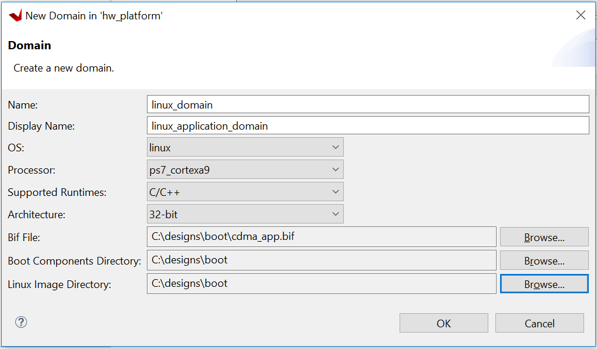

<p align="right">
            Read this page in other languages:<a href="../docs-jp/5-using-hp-port.md">日本語</a>    <table style="width:100%"><table style="width:100%">
  <tr>

<th width="100%" colspan="6"><h1>Zynq-7000 SoC Embedded Design Tutorial 2020.2 (UG1165)</h1>
</th>

  </tr>
  <tr>
    <td width="33%" align="center"><a href="../README.md">1. Introduction</a></td>
    <td width="33%" align="center"><a href="2-using-zynq.md">2. Using the Zynq SoC Processing System</a></td>
    <td width="33%" align="center"><a href="3-using-gp-port-zynq.md">3. Using the GP Port in Zynq Devices</a></td>
</tr>
<tr><td width="33%" align="center"><a href="4-debugging-vitis.md">4. Debugging with the Vitis Software Platform</a></td>
    <td width="33%" align="center">5. Using the HP Slave Port with AXI CDMA IP</td>
    <td width="33%" align="center"><a href="6-linux-booting-debug.md">6. Linux Booting and Debug in the Vitis Software Platform</a></td>
  </tr>
  <tr>
      <td width="33%" align="center"><a href="7-custom-ip-driver-linux.md">7. Creating Custom IP and Device Driver for Linux
  </a></td>
      <td width="33%" align="center"><a href="8-sw-profiling.md">8. Software Profiling Using the Vitis Software Platform</a></td>    
      <td width="33%" align="center"><a href="9-linux-aware-debugging.md">9. Linux Aware Debugging</a></td>    
    </tr>
</table>

# Using the HP Slave Port with AXI CDMA IP

In this chapter, you will instantiate AXI CDMA IP in fabric and
integrate it with the processing system high performance (HP) 64-bit
slave port. In this system, AXI CDMA acts as master device to copy an
array of the data from the source buffer location to the destination
buffer location in DDR system memory. The AXI CDMA uses the processing
system HP slave port to get read/ write access of DDR system memory.

You will write standalone application software and Linux OS based
application software using mmap() for the data transfer using AXI CDMA
block. You will also execute both standalone and Linux-based
application software separately on the ZC702 board.

## Integrating AXI CDMA with the Zynq SoC PS HP Slave Port

Xilinx&reg; Zynq&reg;-7000 SoC devices internally provide four high
performance (HP) AXI slave interface ports that connect the
programmable logic (PL) to asynchronous FIFO interface (AFI) blocks in
the processing system (PS). The HP Ports enable a high throughput data
path between AXI masters in programmable logic and the processing
system\'s memory system (DDR and on- chip memory). HP slave ports are
configurable to 64 bit or 32 bit interfaces.

In this section, you will create a design using AXI CDMA intellectual
property (IP) as master in fabric and integrate it with the PS HP 64
bit slave port. The block diagram for the system is as shown in the
following figure.


This system covers the following connections:

-   AXI CDMA Slave Port is connected to the PS General Purpose master
    port 1 (M_AXI_GP1). It is used by the PS CPU to configure the AXI
    CDMA register set for the data transfer and also to check the
    status.

-   AXI CDMA Master Port is connected to the PS High performance Slave
    Port 0 (S_AXI_HP0). It is used by the AXI CDMA to read from the
    DDR system memory. It acts as the source buffer location for the
    CDMA during data transfer.

-   AXI CDMA Master Port is connected to the PS High performance Slave
    Port 2 (S_AXI_HP2). It is used by the AXI CDMA to write the data
    to the DDR system memory. It acts as a destination buffer location
    for the CDMA during the Data transfer.

-   AXI CDMA interrupt is connected from fabric to the PS section
    interrupt controller. After Data Transfer or Error during Data
    transaction, the AXI CDMA interrupt is triggered.

In this system, you will configure the HP slave port 0 to access a DDR
memory location range from 0x20000000 to 0x2fffffff. This DDR system
memory location acts as the source buffer location to CDMA for reading
the data.

You will also configure HP slave Port 2 to access a DDR memory
Location range from 0x30000000 to 0x3fffffff. This DDR system memory
location acts as a destination location to CDMA for writing the data.

You will also configure the AXI CDMA IP data width of the Data
Transfer channel to 1024 bits with Maximum Burst length set to 32.
With this setting, CDMA Maximum transfer size is set to 1024x32 bits
in one transaction.

You will write the application software code for the above system.
When you execute the code, it first initializes the source buffer
memory with the specified data pattern and also clears the destination
buffer memory by writing all zeroes to the memory location. Then, it
starts configuring the CDMA register for the DMA transfer. It writes
the source buffer location, destination buffer location, and number of
bytes to be transferred to the CDMA registers and waits for the CDMA
interrupt. When the interrupt occurs, it checks the status of the DMA
transfers.

If the data transfer status is successful, it compares the source
buffer data with the destination buffer data and displays the
comparison result on the serial terminal.

If the data transfer status is an error, it displays the error status
on the serial terminal and stops execution.

## Example Project: Integrating AXI CDMA with the PS HP Slave Port

1.  Start with one of the following:

    -   Use the system you created in [Example Project: Validate Instantiated Fabric IP Functionality](3-using-gp-port-zynq.md#example-project-validate-instantiated-fabric-ip-functionality).

    -   Create a new project as described in [Creating an Embedded Processor Project](2-using-zynq.md#creating-an-embedded-processor-project).

2.  Open the Vivado&reg; design from [Using the GP Port in Zynq Devices](3-using-gp-port-zynq.md) called **edt_tutorial** and from the IP integrator click **Open Block Design**.

3.  In the Diagram window, right-click in the blank space and select
    **Add IP**.

4.  In the search box, type CDMA and double-click the **AXI Central
    Direct Memory Access** IP to add it to the Block Design. The AXI
    Central Direct Memory Access IP block appears in the Diagram view.

5.  In the Diagram window, right-click in the blank space and select
    **Add IP**.

6.  In the search box type concat and double-click the **Concat** IP to
    add it to the Block Design. The Concat IP block appears in the
    Diagram window. This block is used to concatenate the two
    interrupt signals if you are using the prior design with the AXI
    Timer.

7.  Right-click the net from the interrupt port to the IRQ_F2P\[0:0\]
    port and select **Delete**.

8.  Click the IRQ_F2P\[0:0\] port and drag to the dout\[1:0\] output
    port on the Concat IP core to make a connection between the two
    ports.

9.  Click the interrupt port on the AXI Timer IP core and drag to the
    In0\[0:0\] input port on the Concat IP core to make a connection
    between the two ports.

10. Click the cdma_introut port on the AXI CDMA IP core and drag to the
    In1\[0:0\] input port on the Concat IP core to make a connection
    between the two ports.

11. Right-click the **ZYNQ7 Processing System** core and select
    **Customize Block**.

12. Select **PS-PL Configuration** and expand the **HP Slave AXI
    Interface**.

13. Select the check box for **S AXI HP0 interface** and for **S AXI HP2
    interface**.

14. Click **OK** to accept the changes.

15. Right-click the **AXI CDMA IP** core and select **Customize Block**.

16. Set the block settings in the Re-customize IP wizard page as
    follows:

    <table>
    <thead>
    <tr class="header">
    <th><blockquote>
    <p><strong>System Property</strong></p>
    </blockquote></th>
    <th><blockquote>
    <p><strong>Setting or Command to Use</strong></p>
    </blockquote></th>
    </tr>
    </thead>
    <tbody>
    <tr class="odd">
    <td><blockquote>
    <p>Enable Scatter Gather</p>
    </blockquote></td>
    <td><blockquote>
    <p>Unchecked</p>
    </blockquote></td>
    </tr>
    <tr class="even">
    <td><blockquote>
    <p>Disable 4K Boundary Checks</p>
    </blockquote></td>
    <td><blockquote>
    <p>Unchecked</p>
    </blockquote></td>
    </tr>
    <tr class="odd">
    <td><blockquote>
    <p>Allow Unaligned Transfers</p>
    </blockquote></td>
    <td><blockquote>
    <p>Unchecked</p>
    </blockquote></td>
    </tr>
    <tr class="even">
    <td><blockquote>
    <p>Write/Read Data Width</p>
    </blockquote></td>
    <td><blockquote>
    <p>1024</p>
    </blockquote></td>
    </tr>
    <tr class="odd">
    <td><blockquote>
    <p>Write/Read Burst Size</p>
    </blockquote></td>
    <td><blockquote>
    <p>32</p>
    </blockquote></td>
    </tr>
    <tr class="even">
    <td><blockquote>
    <p>Enable Asynchronous Mode (Auto)</p>
    </blockquote></td>
    <td><blockquote>
    <p>Unchecked</p>
    </blockquote></td>
    </tr>
    <tr class="odd">
    <td><blockquote>
    <p>Enable CDMA Store and Forward</p>
    </blockquote></td>
    <td><blockquote>
    <p>Unchecked</p>
    </blockquote></td>
    </tr>
    <tr class="even">
    <td><blockquote>
    <p>Address Width</p>
    </blockquote></td>
    <td><blockquote>
    <p>32</p>
    </blockquote></td>
    </tr>
    </tbody>
    </table>

17. Click **OK** to accept the changes.

18. Click the **Run Connection Automation** link in the Diagram window
    to automate the remaining connections.

19. In the Run Connection Automation dialog box make sure the **All
    Automation** box is checked, then click **OK** to accept the
    default connections. The finished diagram should look like the
    following figure.

    ***Note*:** You might receive a critical warning message regarding
    forcibly mapping a net into a conflicting address. Address the error
    by manually updating the memory mapped address in the next steps.
    Click **OK** if you see the error message.

    

20. Select the **Address Editor** window.

        

21. In the Address Editor window, expand **axi_cdma_0 →
    axi_cdma_0/Data**. Right-click **HP2_DDR_LOWOCM** and select **Unassign**.

22. In the Range column for **S_AXI_HP0**, select **256M**.

23. Under Offset Address for **S_AXI_HP0**, set a value of
    **0x2000_0000**.

24. In the Address Editor window, expand **axi_cdma_0 → axi_cdma_0/Data→
    Unassigned**. Right- click on **HP2_DDR_LOWOCM** and select
    **Assign**.

25. In the Range column for **S_AXI_HP2**, select **256M**.

26. Under Offset Address for **S_AXI_HP2**, set a value of
    **0x3000_0000**.

    

27. In the Flow Navigator, select **Generate Bitstream** under PROGRAM
    AND DEBUG. The Save Project dialog box opens.

28. Ensure that the **Block Design - tutorial_bd** check box is
    selected, then click **Save**.

29. A message might appear that states synthesis is out of date. If it
    does, click **Yes**.

30. After the bitstream generation completes, export the hardware and
    launch the Vitis unified software platform as described in
    [Exporting a Hardware Platform](2-using-zynq.md#exporting-a-hardware-platform).

    ***Note*:** Make sure to select **Include bitstream** instead of the
    **Pre-synthesis** on the Output page of the for Export Hardware
    Platform wizard.

### Standalone Application Software for the Design

The CDMA-based system that you designed in this chapter requires
application software to execute on the board. This section describes
the details about the CDMA-based Standalone application software.

The main() function in the application software is the entry point for
the execution. It initializes the source memory buffer with the
specified test pattern and clears the destination memory buffer by
writing all zeroes.

The application software then configures the CDMA registers sets by
providing information such as source buffer and destination buffer
starting locations. To initiate DMA transfer, it writes the number of
bytes to be transferred in the CDMA register and waits for the CDMA
interrupt to happen. After the interrupt, it checks the status of the
DMA transfer and compares the source buffer with the destination
buffer. Finally, it prints the comparison result in the serial
terminal and stops running.

#### Application Software Flow

The application software does the following:

1.  Initializes the source buffer with the specified test pattern. The
    source buffer location ranges from 0x20000000 to 0x2fffffff.

    Clears the destination buffer by writing all zeroes into the
    destination address range. The destination buffer location ranges from
    0x30000000 to 0x3fffffff.

2.  Initializes AXI CDMA IP and does the following:

    a.  Associates a CDMA callback function with AXI CDMA ISR and Enable
        the Interrupt.

    This Callback function executes during the CDMA interrupt. It sets the
    interrupt Done and/or Error flags depending on the DMA transfer
    status.

    Application software waits for the Callback function to populate these
    flags and executes the software according to the status flag.

    b.  Configures the CDMA in Simple mode.

    c.  Checks the Status register of the CDMA IP to verify the CDMA idle
        status.

    d.  Sets the source buffer starting location, 0x20000000, to the CDMA
        register.

    e.  Sets the destination buffer starting location, 0x30000000, to the
        CDMA register.

    f.  Sets the number of bytes to transfer to the CDMA register. The
        application software starts the DMA transfer.

3.  After the CDMA interrupt is triggered, checks the DMA transfer
    status.

    If the transfer status is successful, the application software
    compares the source buffer location with the destination buffer
    location and displays the comparison result on the serial terminal,
    and then exits from the execution.

    If the transfer status displays an error, the software prints the
    error status in the serial terminal and stops running.

### Running the Standalone CDMA Application Using the Vitis Software Platform

1.  Open the Vitis software platform.

2.  Check that the Target Communication Frame (TCF) (hw_server.exe)
    agent is running on your Windows machine. If it is not running in
    theVitis software platform, select **Xilinx → XSCT Console**.

3.  In the XSCT Console view, type Connect. A message appears, stating
    that the hw_server application started, or if it has started and
    is running, you see tcfchan\#, as shown in the following figure.

    

4.  In the Vitis software platform, select **File → New → Application
    Project**. The New Application Project wizard opens.

5.  Use the information in the table below to make your selections in
    the wizard screens.

    <table>
    <thead>
    <tr class="header">
    <th><blockquote>
    <p><strong>Wizard Screen</strong></p>
    </blockquote></th>
    <th><blockquote>
    <p><strong>System Property</strong></p>
    </blockquote></th>
    <th><blockquote>
    <p><strong>Setting or Command to Use</strong></p>
    </blockquote></th>
    </tr>
    </thead>
    <tbody>
    <tr class="odd">
    <td>Platform</td>
    <td>Select a platform from repository</td>
    <td><p>Click <strong>hw_platform [custom]</strong> with the path as</p>
    <p>C:\designs\workspace\hw_platform\export</p>
    <p>\hw_platform\hw_platform.xpfm</p></td>
    </tr>
    <tr class="even">
    <td>Application Project Details</td>
    <td>Application project name</td>
    <td>Enter cdma_app</td>
    </tr>
    <tr class="odd">
    <td>Domain</td>
    <td>Select a domain</td>
    <td>Click <strong>standalone on ps7_cortex9_0</strong>.</td>
    </tr>
    <tr class="even">
    <td>Templates</td>
    <td>Available Templates</td>
    <td>Empty Application</td>
    </tr>
    </tbody>
    </table>

6.  Click **Finish**.

    The New Application Project wizard closes and the Vitis software
    platform creates the cdma_app application project under the Explorer view.

7.  In the Explorer view, expand the **cdma_app** project, right-click
    the **src** directory, and select **Import Sources** to open the Import Sources dialog box.

8.  In the **Import Sources** dialog box, click the **Browse** button
    next to the **From directory** field and specify the design files
    folder you saved earlier (see [Design Files for This
    Tutorial](2-using-zynq.md#design-files-for-this-tutorial)).

9.  Select the cdma_app.c file and click **Finish**.

10. Build the cdma application project either by clicking the hammer
    button or by right-clicking on the **cdma_app** project and
    selecting **Build Project**.

11. Open the serial communication utility with baud rate set to
    **115200**.

    ***Note*:** This is the baud rate that the UART is programmed to on
    Zynq devices.

12. Make sure that the hardware board is set up and turned on.

    ***Note*:** Refer to [Creating a Platform Project in the Vitis Software Platform with an XSA from Vivado](2-using-zynq.md#creating-a-platform-project-in-the-vitis-software-platform-with-an-xsa-from-vivado)
    for information about setting up the board.

13. Select **Xilinx → Program FPGA** to open the Program FPGA dialog
    box. The dialog box shows the bitstream path.

14. Click **Program** to download the bitstream and program the PL
    fabric.

15. Run the project similar to the steps in [Creating a Platform Project
    in the Vitis Software Platform with an XSA from
    Vivado](#creating-a-platform-project-in-the-vitis-software-platform-with-an-xsa-from-vivado).

16. Check the status of the CDMA transfer in the serial terminal. If the
    transfer is successful, the message \"DMA Transfer is Successful\"
    displays. Otherwise, the serial terminal displays an error
    message.

## Linux OS Based Application Software for the CDMA System

In this section, you will create a Linux-based application software
for CDMA using the mmap() system call provided by Linux and run it on
the hardware to check the functionality of the CDMA IP.

The mmap() system call is used to map specified kernel memory area to
the User layer, so that you can read or write on it depending on the
attribute provided during the memory mapping.


***Note*:** Details about the mmap() system call is beyond the scope of this guide.

**CAUTION!** *Use of the mmap() call might crash the kernel if it
accesses, by mistake, some restricted area or shared resources of the
kernel.*

The main() function in the application software is the entry point for
the execution. It initializes the source array with the specified test
pattern and clears the destination array. Then it copies the source
array contents to the DDR memory starting at location 0x20000000 and
makes the DMA register setting to initiate DMA transfer to the
destination. After the DMA transfer, the application reads the status
of the transfer and displays the result on the serial terminal.

### Application Software Creation Steps

Application software creation is composed of the following steps:

1.  Initialize the whole source array, which is in the User layer with
    value 0xa5a5a5a5.

2.  Clear the whole destination buffer, which is in the User layer, by
    writing all zeroes.

3.  Map the kernel memory location starting from 0x20000000 to the User
    layer with writing permission using mmap() system calls.By doing so, you can write to the specified kernel memory.

4.  Copy the source array contents to the mapped kernel memory.

5.  Un-map the kernel memory from the User layer.

6.  Map the AXI CDMA register memory location to the User layer with
    reading and writing permission using the mmap() system call. Make
    the following CDMA register settings from the User layer:

    a.  Reset DMA to stop any previous communication.

    b.  Enable interrupt to get the status of the DMA transfer.

    c.  Set the CDMA in simple mode.

    d.  Verify that the CDMA is idle.

    e.  Set the source buffer starting location, 0x20000000, to the CDMA
        register.

    f.  Set the destination buffer starting location, 0x30000000, to the
        CDMA register.

    g.  Set the number of bytes to be transferred in the CDMA register.
        Writing to this register starts the DMA transfer.

7.  Continuously read the DMA transfer status until the transfer
    finishes.

8.  After CDMA transfer finishes, un-map the CDMA register memory for
    editing from the User layer using the mmap() system call.

9.  Map the kernel memory location starting from 0x30000000 to the User
    layer with reading and writing permissions.

10. Copy the kernel memory contents starting from 0x30000000 to the User
    layer destination array.

11. Un-map the kernel memory from the User layer.

12. Compare the source array with the destination array.

13. Display the comparison result in the serial terminal. If the
    comparison is successful, the message \"DATA Transfer is
    Successful\" displays. Otherwise, the serial terminal displays an
    error message.

## Running Linux CDMA Application Using the Vitis Software Platform

Detailed steps on running Linux on the target board are outlined in
[Linux Booting and Debug in the Vitis
Software Platform](6-linux-booting-debug.md). If you are not comfortable running
Linux, run through the [Linux Booting and Debug in the
Vitis Software Platform](6-linux-booting-debug.md) examples prior to running this
example. Running a Linux OS based application is composed of the
following steps:

1.  [Booting Linux on the Target Board](#booting-linux-on-the-target-board)

2.  [Linux Domain Creation for Linux
    Applications](#linux-domain-creation-for-linux-applications)

3.  [Building an Application and Running it on the Target Board Using
    the Vitis Software
    Platform](#building-an-application-and-running-it-on-the-target-board-using-the-vitis-software-platform)

### Booting Linux on the Target Board

You will now boot Linux on the Zynq-7000 SoC ZC702 target board using
JTAG mode.

***Note*:** Additional boot options will be explained in [Linux Booting and Debug in the Software
Platform](6-linux-booting-debug.md).

1.  Check the following Board Connection and Setting for Linux booting
    using JTAG mode:

    a.  Ensure that the settings of Jumpers J27 and J28 are set as
        described in [Creating a Platform Project in the Vitis Software Platform with an XSA from Vivado](2-using-zynq.md#creating-a-platform-project-in-the-vitis-software-platform-with-an-xsa-from-vivado).

    b.  Ensure that the SW16 switch is set as shown in the following
        figure.

    c.  Connect an Ethernet cable from the Zynq SoC board to your
        network.

    d.  Connect the Windows Host machine to your network.

    e.  Connect the power cable to the board.

        

2.  Connect a micro USB cable between the Windows host machine and the
    target board with the following SW10 switch settings, as shown in
    [Booting Linux on the Target Board](6-linux-booting-debug.md#booting-linux-on-the-target-board).

    -   Bit-1 is 0

    -   Bit-2 is 1

    ***Note*:** 0 = switch is open. 1 = switch is closed. The correct JTAG
    mode has to be selected, according to the user interface. The JTAG
    mode is controlled by switch SW10 on the ZC702 and SW4 on the ZC706.

    

3.  Connect a USB cable to connector J17 on the target board with the
    Windows Host machine. This is used for USB to serial transfer.

4.  Change Ethernet Jumper J30 and J43 as shown in the following figure.

        

5.  Power on the target board.

6.  Launch the Vitis software platform and open the same workspace you
    used in [Using the Zynq SoC Processing System](2-using-zynq.md) and [Using the GP Port in Zynq Devices](3-using-gp-port-zynq.md).

7.  If the serial terminal is not open, connect the serial communication
    utility with the baud rate set to **115200**.

    ***Note*:** This is the baud rate that the UART is programmed to on
    Zynq devices.

8.  Select **Xilinx → Program FPGA**, then click **Program** to download
    the bitstream.

9.  Open the Xilinx System Debugger (XSCT) tool by selecting **Xilinx →
    XSCT Console**.

10. At the XSCT prompt, do the following:

    a.  Type connect to connect with the PS section.

    b.  Type targets to get the list of target processors.

    c.  Type targets 2 to select the processor CPU1.

        ```
        xsct% targets
        1 APU
        2 Arm Cortex-A9 MPCore #0 (Running)
        3 Arm Cortex-A9 MPCore #1 (Running)
        4 xc7z020
        xsct% targets 2
        xsct% targets
        1 APU
        2* Arm Cortex-A9 MPCore #0 (Running)
        3 Arm Cortex-A9 MPCore #1 (Running)
        4 xc7z020
        ```

    d.  Type dow \<tutorial_download_path\>/zynq_fsbl.elf to download
        PetaLinux FSBL.

    e.  Type con to start execution of FSBL and then type stop to stop
        it.

        

    f.  Type dow \<tutorial_download_path\>/u-boot.elf to download PetaLinux
        U- Boot.elf.

    g.  Type con to start execution of U-Boot.  On the serial terminal, the autoboot countdown message appears:

      	``Hit any key to stop autoboot: 3``

    h.  Press **Enter**.

        Automatic booting from U-Boot stops and a command prompt appears on
        the serial terminal.

        

    i.  At the XSCT Prompt, type stop. The U-Boot execution stops.

    j.  Type dow -data \<tutorial_download_path\>/image.ub 0x30000000 to
        download the Linux Kernel image at location 0x3000000.

    k.  Type con to start executing U-Boot.

11. At the command prompt of the serial terminal, type bootm 0x30000000.
    The Linux OS boots.

12. If required, provide the Zynq login as **root** and the password as
    **root** on the serial terminal to complete booting the processor.

    After booting completes, \# prompt appears on the serial terminal.

13. At the root\@Xilinx-ZC702-2020.1:\~\# prompt, make sure that the
    board Ethernet connection is configured:

    a.  Check the IP address of the board by typing the following
        command at the Zynq prompt: ``ifconfig eth0``.

    This command displays all the details of the currently active
    interface. In the message that displays, the inet addr value denotes
    the IP address that is assigned to the Zynq SoC board.

    b.  If inet addr and netmask values do not exist, you can assign them
        using the following commands:

        ```
        root@Xilinx-ZC702-2020.1:~# ifconfig eth0 inet 192.168.1.10
        root@Xilinx-ZC702-2020.1:~# ifconfig eth0 netmask 255.255.255.0
        ```

14. Confirm that the IP address settings on the Windows machine are set
    up to match the board settings. Adjust the local area connection
    properties by opening your network connections.

    a.  Right-click the local area connection that is linked to the
        XC702 board and select Properties.

    b.  In the Local Area Connection Properties dialog box, select
        **Internet Protocol Version 4 (TCP/IPv4)** from the item list and
        select **Properties**.

    c.  Select **Use the following IP address** and set the following
        values:

        ```
        IP address: 192.168.1.11
        Subnet mask: 255.255.255.0
        ```

    d.  Click **OK** to accept the values.

15. In the Windows machine command prompt, check the connection with the
    board by typing ping followed by the board IP address. The ping response displays in a loop.

    This response means that the connection between the Windows host
    machine and the target board is established.

16. Press **Ctrl+C** to stop displaying the ping response on the Windows
    host machine command prompt.

    

    Linux booting completes on the target board and the connection between
    the host machine and the target board is complete.

### Linux Domain Creation for Linux Applications

Now that Linux is running on the board, you can create a Linux domain
followed by a Linux application. The steps to create a Linux domain
are given below:

1.  Go to the Explorer view in the Vitis software platform and expand
    the **hw_platform** platform project.

2.  Open the hardware by double clicking **platform.spr**.

3.  The platform view opens. Click the **+** button in the right corner
    to add a domain, as shown in the following figure.

    

4.  When the New Domain dialog box opens, enter the details as given
    below:

    -   **Name:** linux_domain

    -   **Display Name:** linux_application_domain

    -   **OS:** Linux

    -   **Processor:** ps7_cortexa9

    -   ###### Supported Runtimes: C/C++

Select **Use pre-built software components**, then under this:

a.  Create one boot directory in the C:\\designs folder, then copy the
    boot components into it (FSBL, PMUFW from the Vitis software
    platform, ATF, u-boot.elf and image.ub from PetaLinux).

b.  Create one BIF file as below.

       

5.  Click **OK** to finish and observe
    that the Linux domain has been added to the hw_platform as shown
    below.

        

    Now you are ready with Linux domain to create Linux applications.

### Building an Application and Running it on the Target Board Using the Vitis Software Platform

1.  Now that Linux is running on the board, create a Linux application
    to use the CDMA. Select File → New → Application Project.

2.  Use the information in the table below to make your selections in
    the wizard screens.

    <table>
    <thead>
    <tr class="header">
    <th><blockquote>
    <p><strong>Wizard Screen</strong></p>
    </blockquote></th>
    <th><blockquote>
    <p><strong>System Property</strong></p>
    </blockquote></th>
    <th><blockquote>
    <p><strong>Setting or Command to Use</strong></p>
    </blockquote></th>
    </tr>
    </thead>
    <tbody>
    <tr class="odd">
    <td>Platform</td>
    <td>Select a platform from repository</td>
    <td>Click <strong>hw_platform [custom]</strong>.</td>
    </tr>
    <tr class="even">
    <td>Application Project Details</td>
    <td>Application project name</td>
    <td>Enter linux_cdma_app</td>
    </tr>
    <tr class="odd">
    <td></td>
    <td>Select target processor for the Application project</td>
    <td>Select <strong>ps7_cortexa9 SMP</strong>.</td>
    </tr>
    <tr class="even">
    <td>DomainDomain</td>
    <td>Select a domain</td>
    <td>Click linux_application_domain</td>
    </tr>
    <tr class="odd">
    <td></td>
    <td>Application settings</td>
    <td>If known, enter the sysroot, root FS, and kernal image paths. Otherwise, leave these options blank.</td>
    </tr>
    <tr class="even">
    <td>Templates</td>
    <td>Available Templates</td>
    <td>Linux Empty Application</td>
    </tr>
    </tbody>
    </table>

3.  Click **Finish**.

    The New Application Project wizard closes and the Vitis software
    platform creates the linux_cdma_app project under the Explorer view.

4.  In the Explorer view, expand linux_cdma_app project, right-click the
    **src** directory, and select **Import Sources** to open the
    Import Sources dialog box.

5.  In the **Import Sources** dialog box, click the **Browse** button
    next to the **File system** field and specify the design files
    directory already downloaded. Select the **linux_cdma_app.c**
    example application file and click **Finish**.

    ***Note*:** The example application software file is available in the
    ZIP file that accompanies this guide. See [Design Files for This
    Tutorial](2-using-zynq.md#design-files-for-this-tutorial).

6.  Build the application project either by clicking the hammer button
    or by right-clicking on the linux_cdma_app project and selecting
    **Build Project**. The binary file linux_cdma_app.elf is
    generated.

7.  Right-click linux_cdma_app and select **Run As → Run
    Configurations** to open the Run Configurations dialog box, shown
    in the following figure.

8.  Right-click **Xilinx C/C++ application (Application Debugger)** and select **New**.

        

9.  Click **New** button next to the Connection to open the Target
    Connection Details dialog box.

10. In the Target Connection Details dialog box, apply the settings
    below:

    a.  Specify a name in the **Target Name** field. For the purposes of
        this exercise, use CDMALinux.

    b.  In the **Host** field, enter the target board IP address.

    To determine the target board IP address, type ifconfig eth0 at the
    Zynq\prompt in the serial terminal. The terminal displays the target
    IP address that is assigned to the board.

    c.  In the **Port** field, type 1534.

11. Click **OK** to create the connection.

12. As shown in the following figure, on the **Application** tab, enter
    application data settings for the following:

    a.  Project Name: linux_cdma_app

    b.  Local File Path: Debug/linux_cdma_app.elf

    c.  Remote File Path: /tmp/cdma.elf

    

13. Click **Run**. The application executes, and the message DATA
    Transfer is Successful appears in the console window, as shown in the following figure.

    

    © Copyright 2015–2020 Xilinx, Inc.
