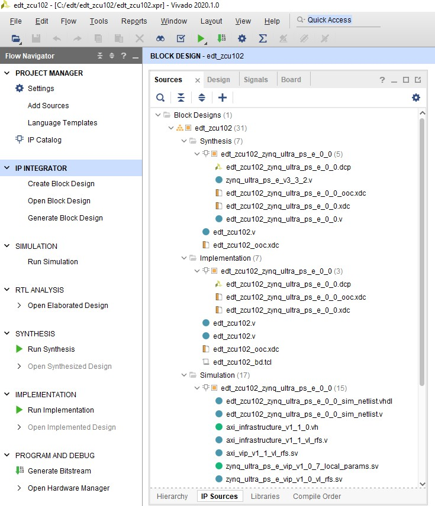

            Read this page in other languages:<a href="../docs-jp/3-system-configuration.md">日本語</a>    <table style="width:100%"><table style="width:100%">
  <tr>

<th width="100%" colspan="6"><h1>Zync UltraScale+ MPSoC Embedded Design Tutorial 2020.2 (UG1209)</h1>
</th>

  </tr>
  <tr>
    <td width="17%" align="center"><a href="../README.md">1. Introduction</a></td>
    <td width="16%" align="center"><a href="2-getting-started.md">2. Getting Started</a></td>
    <td width="17%" align="center">3. Zynq UltraScale+ MPSoC System Configuration</td>
    <td width="17%" align="center"><a href="4-build-sw-for-ps-subsystems.md">4. Build Software for PS Subsystems</a></td>
</tr>
<tr>
    <td width="17%" align="center"><a href="5-debugging-with-vitis-debugger.md">5. Debugging with the Vitis Debugger</a></td>
    <td width="16%" align="center"><a href="6-boot-and-configuration.md">6. Boot and Configuration</a></td>
    <td width="17%" align="center"><a href="7-system-design-examples.md">7. System Design Examples</a></td>
    <td width="17%" align="center"><a href="8-debugging-problems-with-secure-boot.md">8. Debugging Problems with Secure Boot</a></td>    
  </tr>
</table>

# Zynq UltraScale+ MPSoC Processing System Configuration

 This chapter demonstrates how to use the Vivado® Design Suite to
 develop an embedded system using the Zynq® UltraScale+™ MPSoC
 Processing System (PS).

 The Zynq UltraScale+ device consists of quad-core Arm®
 Cortex™-A53-based APU, dual-core Arm® Cortex™-R5F RPU, Mali™ 400 MP2
 GPU, many hard Intellectual Property (IP) components, and Programmable
 Logic (PL). This offering can be used in two ways:

- The Zynq UltraScale+ PS can be used in a standalone mode, without
    attaching any additional fabric IP.

- IP cores can be instantiated in fabric and attached to the Zynq
    UltraScale+ PS as a PS+PL combination.

## Zynq UltraScale+ System Configuration

 Creating a Zynq UltraScale+ system design involves configuring the PS
 to select the appropriate boot devices and peripherals. To start with,
 as long as the PS peripherals and available MIO connections meet the
 design requirements, no bitstream is required. This chapter guides you
 through creating a simple PS-based design that does not require a
 bitstream.

 In addition to the basic PS configuration, this chapter will briefly
 touch upon the concept of [Isolation
 Configuration](#isolation-configuration) to create subsystems with
 protected memory and peripherals. This advanced configuration mode in
 the PS Block enables you to setup subsystems comprising Masters with
 dedicated memory and peripherals. The protection is provided by the
 XMPU and the XPPU in Zynq UltraScale+ PS block. The isolation
 configuration also allows the TrustZone settings for components to
 create and configure the systems in Secure and Non-Secure
 Environments.

## Example Project: Creating a New Embedded Project with Zynq UltraScale+ MPSoC

 For this example, you will launch the Vivado Design Suite and create a
 project with an embedded processor system as the top level.

### Starting Your Design

1. Launch the Vivado Design Suite.

2. In the Vivado Quick Start page, click **Create Project** to open the
     New Project wizard.

3. Use the information in the following table to make selections in
     each of the wizard screens.

    *Table 1:* **New Project Wizard Options**

   | Wizard Screen       | System Property     | Setting or  Command to Use     |
   |---------------------|---------------------|----------------------|
   |  Project Name       |  Project name       |  edt_zcu102         |
   |                     |  Project Location   |  C:/edt             |
   |                     |  Create ProjecSub-directory     |  Leave this checked |
   |  Project Type       |  Specify the type of sources for your design. You can start with RTL or a synthesized EDIF. |  **RTL Project**    |
   |                     |  Do not specify sources at this time check box    |  Leave this unchecked.       |
   |  Add Sources        |  Do not make any  changes to this screen.  
   |  Add Constraints    |  Do not make any changes to this screen.  
   |  Default Part       |  Select             |  **Boards**         |
   |                     |  Display Name       |  Zynq UltraScale+ ZCU102 Evaluation Board  |
   |  New Project Summary       |  Project Summary    |  Review the project summary|

4. Click **Finish**. The New Project wizard closes and the project you
     just created opens in the Vivado design tool.

### Creating a Block Design Project

 You will now use the IP integrator to create a Block Design project.

1. In the Flow Navigator pane, expand IP integrator and click **Create
     Block Design**.

	

    The Create Block Design wizard opens.

2. Use the following information to make selections in the Create Block Design wizard.

	*Table 2:* **Setting in Create Block Design Wizard**

   |  Wizard Screen      | System Property     |  Setting or Command to Use      |
   |---------------------|---------------------|---------------------------------|
   |  Create Block Design|  Design Name        |  edt_zcu102         |
   |                      |  Directory          |  `<Local to Project>`         |
   |                      |  Specify Source Set |  Design Sources     |

3. Click **OK**.

	 The Diagram view opens with a message that states that this design is
	 empty. To get started, you will next add some IP from the catalog.

4. Click **Add IP**
     .

5. In the search box, type zynq to find the Zynq device IP.

6. Double-click the **Zynq UltraScale+ MPSoC IP** to add it to the
     Block Design.

 The Zynq UltraScale+ MPSoC processing system IP block appears in the
 Diagram view, as shown in the following figure.

 

### Managing the Zynq UltraScale+ Processing System in Vivado

 Now that you have added the processor system for the Zynq MPSoC to the
 design, you can begin managing the available options.

1. Double-click the **Zynq UltraScale+ Processing System** block in the
     Block Diagram window.

    The Re-customize IP view opens, as shown in the following figure.
    Notice that by default, the processor system does not have any
    peripherals connected.

    

2. Click **Cancel** to exit the view
     without making changes to the design.

    >**TIP:** *In the Block Diagram window, notice the message stating that
    designer assistance is available, as shown in the following figure.
    When designer assistance is available, you can click the link to have
    Vivado perform that step in your design.*

    

3. You will now use a preset template created for the ZCU102 board.
     Click the **Run Block Automation** link.

    The Run Block Automation view opens.

4. Click **OK** to accept the default processor system options and make
     default pin connections.

    This configuration wizard enables many peripherals in the Processing
    System with some multiplexed I/O (MIO) pins assigned to them according
    to the board layout of the ZCU102 board. For example, UART0 and UART1
    are enabled. The UART signals are connected to a USB-UART connector
    through UART to the USB converter chip on the ZCU102 board.

5. To verify, double-click the Zynq UltraScale+ Processing System block
     in the block diagram window.

    Note the check marks that appear next to each peripheral name in the
    Zynq UltraScale+ device block diagram, signifying the I/O Peripherals
    that are active.

    

6. In the block diagram, click one of the green I/O Peripherals, as
     shown in the previous figure. The I/O Configuration view opens for
     the selected peripheral.

    

    This page enables you to configure low speed and high speed
    peripherals. For this example, you will continue with the basic
    connection enabled using Board preset for ZCU102.

7. In the Page Navigator, select **PS-PL Configuration**.

8. In PS-PL Configuration, expand **PS-PL Interfaces** and expand the
     **Master Interface**.

    For this example, because there is no design in PL, you can disable
    the PS-PL interface. In this case, AXI HPM0 FPD and AXI HPM1 FPD
    Master Interfaces can be disabled.

9. Deselect **AXI HPM0 FPD** and **AXI HPM1 FPD**. The PS-PL
     configuration looks like following figure.

    

10. Click **OK** to close the Re-customize IP wizard.

### Isolation Configuration

 This section is for reference only. It explains the importance of
 Isolation Configuration settings for different use-cases. Different
 use-cases may need to establish Isolation Configurations on a need
 basis. Isolation configuration is optional and you can set it as per
 your system requirement. Safety/Security critical use cases typically
 require isolation between safe/non-safe or secure/ non-secure portions
 of the design. This requires a safe/secure region that contains a
 master (such as the RPU) along with its slaves (memory regions and
 peripherals) to be isolated from non-safe or non-secure portions of
 the design. In such cases, the TrustZone attribute can be applied to
 the dedicated peripherals or memory locations. In this way only a
 valid and trusted master can access the secure slaves. Another
 use-case requiring Isolation is for Platform and Power management. In
 this case, independent subsystems can be created with masters and
 slaves. This is used to
 identify dependencies during run-time power management or warm restart
 for upgrade or recovery. An example of this use-case can be found on
 the [Zynq UltraScale+ Restart solution
 wiki](https://xilinx-wiki.atlassian.net/wiki/spaces/A/pages/18841820/Zynq%2BUltraScale%2BPlus%2BRestart%2Bsolution)
 [page](https://xilinx-wiki.atlassian.net/wiki/spaces/A/pages/18841820/Zynq%2BUltraScale%2BPlus%2BRestart%2Bsolution).
 The Xilinx Memory Protection Unit (XMPU) and Xilinx Peripheral
 Protection Unit (XPPU) in Zynq UltraScale+ provide hardware protection
 for memory and peripherals. These protection units complement the
 isolation provided by TrustZone and the Zynq UltraScale+ MPSoC SMMU.

 The XMPU and XPPU in Zynq UltraScale+ allow the isolation of resources
 at the SoC level. Arm MMU and TrustZone enable isolation within Arm
 Cortex-A53 core APU. Hypervisor and SMMU allow setting isolation
 between Cortex-A53 cores. From a tools standpoint, these protection
 units can be configured using Isolation Configuration in Zynq
 UltraScale+ PS IP wizard. The isolation settings are exported as an
 initialization file which is loaded as a part of the bootloader,
 which, in this case, is the First Stage Boot Loader (FSBL). For more
 details, see the *Zynq UltraScale Device Technical Reference Manual*
 ([UG1085](https://www.xilinx.com/cgi-bin/docs/ndoc?t=user_guides%3Bd%3Dug1085-zynq-ultrascale-trm.pdf)).

1. Double-click **Zynq UltraScale+ Processing System** in the block
     diagram window, if it is not open.

2. Select **Switch To Advanced Mode**.

    Notice the protection elements indicated by red blocks in the wizard.

    

3. To create an isolation setup, click **Isolation Configuration**.

    This tutorial does not use Isolation Configuration and hence, no
    Isolation related settings are requested.

4. Click **OK** to close the Re-customize IP wizard.

    >***Note*:** For detailed steps to create isolation configuration, see
    *Isolation Methods in Zynq UltraScale+ MPSoC*
    ([XAPP1320](https://www.xilinx.com/support/documentation/application_notes/xapp1320-isolation-methods.pdf)).

### Validating the Design and Connecting Ports

 Use the following steps to validate the design:

1. Right-click in the white space of the Block Diagram view and select
     **Validate Design**. Alternatively, you can press the F6 key.

    A message dialog box that states \"Validation successful. There are no
    errors or critical warnings in this design\" opens.

2. Click **OK** to close the message.

3. In the Block Design view, click the **Sources** page.

4. Click **Hierarchy**.

5. Under Design Sources, right-click **edt_zcu102** and select **Create
     HDL Wrapper**.

    The Create HDL Wrapper dialog box
    opens. Use this dialog box to create a HDL wrapper file for the
    processor subsystem.

    >**TIP:** *The HDL wrapper is a top-level entity required by the design
    tools.*

6. Select **Let Vivado Manage Wrapper** and auto-update and click
     **OK**.

7. In the Block Diagram, Sources window, under Design Sources, expand
     **edt_zcu102_wrapper**.

8. Right-click the top-level block diagram, titled **edt_zcu102_i :
     edt_zcu102 (edt_zcu102.bd)** and select **Generate Output
     Products**.

    The Generate Output Products dialog box opens, as shown in the
    following figure.

    

    >***Note*:** If you are running the Vivado Design Suite on a Linux host
    machine, you might see additional options under Run Settings. In this
    case, continue with the default settings.

9.  Click **Generate**.

    This step builds all required output products for the selected source.
    For example, constraints do not need to be manually created for the IP
    processor system. The Vivado tools automatically generate the XDC file
    for the processor subsystem when **Generate Output Products** is
    selected.

10. Click **OK**, if you see the message: "Out-of-context module run was launched for generating output products".

11. When the Generate Output Products process completes, click **OK**.

12. In the Block Diagram Sources window, click the IP Sources page. Here
     you can see the output products that you just generated, as shown
     in the following figure.

    

### Exporting Hardware Platform

To write a hardware platform using the GUI, follow these steps:

1. Select **File→ Export → Export Hardware** in the Vivado Design
     Suite. The Export Hardware Platform window opens.

2. Select Platform Type as **Fixed**.

3. Click **Next**.

4. In the output window, select **Pre-synthesis** and click **Next**.

5. Provide the **XSA file name** and **Export path**, then click **Next**.

     

6. Click **Finish** to generate the hardware platform file in the
     specified path.

© Copyright 2017-2020 Xilinx, Inc.
