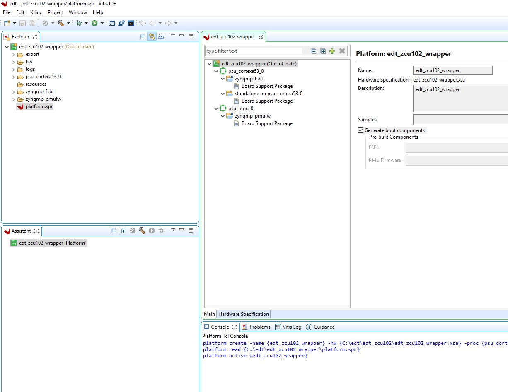
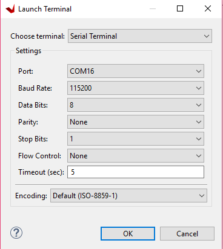
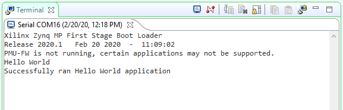

<p align="right">
            Read this page in other languages:<a href="../docs-jp/4-build-sw-for-ps-subsystems.md">日本語</a>    <table style="width:100%"><table style="width:100%">
  <tr>

<th width="100%" colspan="6"><h1>Zync UltraScale+ MPSoC Embedded Design Tutorial 2020.2 (UG1209)</h1>
</th>

  </tr>
  <tr>
    <td width="17%" align="center"><a href="../README.md">1. Introduction</a></td>
    <td width="16%" align="center"><a href="2-getting-started.md">2. Getting Started</a></td>
    <td width="17%" align="center"><a href="3-system-configuration.md">3. Zynq UltraScale+ MPSoC System Configuration</a></td>
    <td width="17%" align="center">4. Build Software for PS Subsystems</td>
</tr>
<tr>
    <td width="17%" align="center"><a href="5-debugging-with-vitis-debugger.md">5. Debugging with the Vitis Debugger</a></td>
    <td width="16%" align="center"><a href="6-boot-and-configuration.md">6. Boot and Configuration</a></td>
    <td width="17%" align="center"><a href="7-system-design-examples.md">7. System Design Examples</a></td>
    <td width="17%" align="center"><a href="8-debugging-problems-with-secure-boot.md">8. Debugging Problems with Secure Boot</a></td>    
  </tr>
</table>

# Build Software for PS Subsystems

 This chapter lists the steps to configure and build software for PS
 subsystems. In this chapter, you will use the Zynq® UltraScale+™
 hardware platform (hardware definition file) configured in the Vivado®
 Design Suite.

 In [Zynq UltraScale+ MPSoC Processing System
 Configuration](3-system-configuration.md), you created and exported the hardware
 platform from Vivado. This hardware platform contains the hardware
 handoff file, the processing system initialization files (psu_init),
 and the PL bitstream. In this chapter, you will use the hardware
 platform in the Vitis™ IDE and PetaLinux to configure software for the
 processing system.

 This chapter serves two important purposes. One, it helps you build
 and configure the software components that can be used in future
 chapters. Second, it describes the build steps for a specific PS
 subsystem.

## Processing Units in Zynq UltraScale+

 The main processing units in the processing system in Zynq UltraScale+
 are listed below.

- **Application Processing Unit:** Quad-core Arm® Cortex™-A53 MPCore
     Processors.

- **Real Time Processing Unit:** Dual-core Arm Cortex™-R5F MPCore
     Processors.

- **Graphics Processing Unit:** Arm Mali™ 400 MP2 GPU

- **Platform Management Unit (PMU):**

 This section demonstrates configuring these units using system
 software. This can be achieved either at the boot-level using First
 Stage Boot Loader (FSBL) or via system firmware, which is applicable
 to the platform management unit (PMU).

 You will use the Zynq UltraScale+ hardware platform in the Vitis IDE
 to perform the following tasks:

1. Create a First Stage Boot Loader (FSBL) for the Arm Cortex-A53
     64-bit quad-core processor unit (APU) and the Cortex-R5F dual-core
     real-time processor unit (RPU).

2. Create bare-metal applications for APU and RPU.

3. Create platform management unit (PMU) firmware for the platform
     management unit using the Vitis IDE.

 In addition to the bare-metal applications, this chapter also
 describes building U-Boot and Linux Images for the APU. The Linux
 images and U-Boot can be configured and built using the PetaLinux
 build system.

## Creating a Platform Using Vitis IDE

1. Launch the Vitis IDE from the Windows start menu shortcut or by
     double-clicking the `C:\Xilinx\Vitis\2020.1\bin\vitis.bat` file.

2. Select the workspace and continue.

   

3. In the Vitis IDE, go to **File → New → Platform Project**.

4. In the Create New Platform page, enter the platform name and click
     **Next**.

5. In the Platform view, select **Create from hardware specification
     (XSA)**. Browse the XSA file and select the preferred operating
     system, processor, and architecture.

    

6. Click **Finish**.

7. In a few minutes, the Vitis IDE generates the platform. The files
     that are generated are displayed in the explorer window as shown
     in the following figure.

    

8. Default FSBL and PMU firmware comes with the platform project and
     psu_cortexa53_0 domain also added to the platform. We can add
     multiple domains to platform and we can also create FSBL like any
     other application.

9. Optional: To add the following libraries by modifying the standalone
     on psu_cortexa53_0 domain, follow these steps:

    a.  Double-click the **standalone on psu_cortexa53_0** BSP.

    b.  Click **Modify BSP Settings**.

    c.  On the Overview page, select the xilffs, xilpm, xilsecure libraries.

10. Now build the hardware by right-clicking the platform, then
     selecting **Build Project**.

    

    The hardware platform is ready. You can create applications using this
    platform and test on zcu102 hardware.

## Example Project: Running the "Hello World" Application from Arm Cortex-A53

 In this example, you will learn how to manage the board settings, make
 cable connections, connect to the board through your PC, and run a
 simple hello world software application from Arm Cortex-A53 in JTAG
 mode using System Debugger in the Vitis IDE.

### Board Setup

1. Connect the power cable to the board.

2. Connect a USB micro cable between the Windows host machine and J2 USB JTAG connector on the target board.

3. Connect a USB micro cable to connector J83 on the target board with the Windows host machine.
     This is used for USB to serial transfer.

	 >**IMPORTANT!** *Ensure that SW6 Switch, on the bottom right, is set to
	 JTAG boot mode as shown in the following figure.*
	 >
	 > 

4. Power on the ZCU102 board using the switch indicated in the figure
     below.

    

To send the \"Hello World\" string to the UART0 peripheral, follow these steps:

1. Open the Vitis IDE and set the workspace path to your project file,
     which in this example is `C:\\edt`.

    Alternately, you can open the Vitis IDE with a default workspace and
    later switch it to the correct workspace by selecting **File→ Switch
    Workspace** and then selecting the workspace.

2. Open a serial communication utility for the COM port assigned on
     your system. The Vitis IDE provides a serial terminal utility,
     which will be used throughout the tutorial; select **Window→ Show
     View→ Terminal** to open it.

3.  Click the **Connect** button to set the serial configuration and connect it.

    

4. To modify, disconnect the connection by clicking the **Disconnect**
     button.

5. Click the **Settings** button to open the Terminal Settings view.

6. Verify the port details in the device manager.

    UART-0 terminal corresponds to COM port with Interface-0. For this
    example, UART-0 terminal is set by default, so for the COM port,
    select the port with interface-0.

    The following figure shows the standard configuration for the Zynq
    UltraScale+ MPSoC Processing System.

    

7. Select **File→ New → Application Project**. The Create new
     application project wizard welcome screen opens.

8. Click **Next**.

9. Use the information in the table below to make your selections in
     the wizard screens.

    *Table 3:* **New Application Project Settings for Standalone APU Application

   |  Wizard Screen       |  System Properties          |  Settings       |
   |----------------------|-----------------------------|----------------------|
   |  Platform           |  Select platform from repository   |  edt_zcu102_wrapper |
   |  Application project details       |  Application project name       |  test_a53           |
   |                      |  System project name    |  test_a53_system    |
   |                      |  Target processor   |  psu_cortexa53_0    |
   |  Domain              |  Domain             |  standalone on psu_cortexa53_0     |
   |  Templates          |  Available templates         |  Hello World        |

    The Vitis IDE creates the test_a53 application project and
    test_a53_system project in the Explorer view. Right-click the
    **test_a53 application project** and select **Build** to build the
    application.

10. Right-click **test_a53** and select **Run as → Run Configurations**.

11. Right-click **Xilinx Application Debugger** and click **New
     Configuration**.

    The Vitis IDE creates the new run configuration, named
    Debugger_test_a53-Default.

    The configurations associated with the application are pre-populated
    in the Main page of the launch configurations.

12. Click the **Target Setup** page and review the settings.

    >***Note*:** The board should be in JTAG boot mode before power
    cycling.

13. Power cycle the board.

14. Click **Run**.

    Hello World appears on the serial communication utility in Terminal 1,
    as shown in the following figure.

    

    >***Note*:** There was no bitstream download required for the above
    software application to be executed on the Zynq UltraScale+ evaluation
    board. The Arm Cortex-A53 quad-core is already present in the
    processing system. Basic initialization of this system to run a simple
    application is done by the device initialization Tcl script.

15. Power cycle the board and retain same connections and board settings
     for the next section.

#### What Just Happened?

 The application software sent the \"Hello World\" string to the UART0
 peripheral of the PS section.

 From UART0, the \"Hello world\" string goes byte-by-byte to the serial
 terminal application running on the host machine, which displays it as
 a string.

## Creating a Domain for cortexr5_0

To create a Vitis domain for cortexr5_0, follow these steps:

1. The edt_zcu102_wrapper platform is, by default, assigned the default
     domain for psu_cortexa53_0. For applications targeting the RPU,
     you have to create a domain for cortexr5_0.

2. Double-click `platform.spr`. The platform opens in the Explorer
     view.

3. Click in the top-right corner to add a domain .

4. Create a domain with the following settings:

    *Table 4:* **Settings to Create a New Domain**

   |  System Properties                |  Setting or Command to Use      |
   |-----------------------------------|---------------------------------|
   | Name                              | psu_cortexr5_0                  |
   | Display name                      | psu_cortexr5_0                  |
   | OS                                | Standalone                      |
   | Version                           | Standalone (7.1)                |
   | Processor                         | psu_cortexr5_0                  |
   | Supported Runtime                 | C/C++                           |
   | Architecture                      | 32-bit                          |

5.  The Vitis IDE creates a new domain and psu_cortexr5_0 appears under
     the edt_zcu102_wrapper platform.

    >***Note*:** Add the xilffs, xilpm, and xilsecure libraries by
    modifying psu_cortexr5_0 domain. To do so, double-click standalone on
    psu_cortexr5_0 BSP, then click **Modify BSP Settings**. On the
    Overview page, select the desired libraries.

## Example Project: Running the "Hello World" Application from Arm Cortex-R5

 In this example, you will learn how to manage the board settings, make
 cable connections, connect to the board through your PC, and run a
 simple hello world software application for the Arm Cortex-R5F
 processor in the JTAG mode using System Debugger in the Vitis IDE.

 >***Note*:** If you have already set up the board, skip to step 5.

1. Connect the power cable to the board.

2. Connect a USB micro cable between the Windows Host machine and the
     J2 USB JTAG connector on the target board.

3. Connect a USB cable to connector J83 on the target board with the
     Windows Host machine. This is used for USB to serial transfer.

4. Power on the ZCU102 board using the switch indicated in

 >***Note*:** If the Vitis IDE is already open, jump to step 6.

5. Launch the Vitis IDE and set the workspace path to your project
     file, which in this example is `C:\\edt\`.

    Alternately, you can open the Vitis IDE with a default workspace and
    later switch it to the correct workspace by selecting **File → Switch
    Workspace** and then selecting the workspace.

6. Open a serial communication utility
     for the COM port assigned on your system. The Vitis IDE provides a
     serial terminal utility, which will be used throughout the
     tutorial; select **Window → Show View→ Terminal** to open it.

     

7. Click **Connect** to set the serial configuration and connect it.

8. Click **Settings** to open the Terminal Settings view.

    The Com-port details can be found in the device manager on host
    machine. UART-0 terminal corresponds to Com-Port with Interface-0. For
    this example, UART-0 terminal is set by default, so for the Com-port,
    select the port with interface-0. The following figure shows the
    standard configuration for the Zynq UltraScale+ MPSoC Processing
    System.

    

9. In the Vitis IDE, switch back from the Debug perspective to the
     C/C++ perspective by selecting **Windows→ Open Perspective →
     C/C++**.

    Ignore this step, if the Vitis IDE is already in the C/C++
    perspective.

10. Select **File→ New → Application Project**. The New Project wizard
     opens.

11. Use the information in the following table to make your selections
     in the wizard screens.

     *Table 5:* **System Properties**

   |  Wizard Screen       |  System Properties   |  Settings            |
   |----------------------|----------------------|----------------------|
   | Platform             | Select platform from repository | edt_zcu102_wrapper   |
   | Application project details | Application project name | hello_world_r5       |
   |                      | System project name  | hello_world_r5_system                    |
   |                      | Target processor     | psu_cortexr5_0       |
   | Domain               | Domain               | psu_cortexr5_0       |
   | Templates            | Available templates  | Hello World          |

    The Vitis IDE creates the hello_world_r5 application project and
    hello_world_r5_system project under the Project Explorer. You have to
    compile the application manually.

12. Right-click **hello_world_r5** and select **Run as → Run
     Configurations**.

13. Right-click **Xilinx Application Debugger** and click **New
     Configuration**.

    The Vitis IDE creates the new run configuration, named
    Debugger_hello_world_r5-Default. The configurations associated with
    the application are pre-populated in the Main page of the launch
    configurations.

14. Click the **Target Setup** page and review the settings.

    This file is exported when you create the platform using the Vitis
    IDE; it contains the initialization information for the processing
    system.

15. Click **Run**.

    

    \"Hello World\" appears on the serial
    communication utility in Terminal 1, as shown in the following figure.

    >***Note*:** There was no bitstream download required for the above
    software application to be executed on the Zynq UltraScale+ evaluation
    board. The Arm Cortex-R5F dual core is already present on the board.
    Basic initialization of this system to run a simple application is
    done by the device initialization Tcl script.

#### What Just Happened?

 The application software sent the \"Hello World" string to the UART0
 peripheral of the PS section.

 From UART0, the \"Hello world\" string goes byte-by-byte to the serial
 terminal application running on the host machine, which displays it as
 a string.

## Additional Information

### Domain

 A domain can refer to the settings and files of a standalone BSP, a
 Linux OS, a third-party OS/BSP like FreeRTOS, or a component like the
 device tree generator.

#### Board Support Package

 The board support package (BSP) is the support code for a given
 hardware platform or board that helps in basic initialization at power
 up and helps software applications to be run on top of it. It can be
 specific to some operating systems with boot loader and device
 drivers.

 >**TIP:** *To reset the BSP source, double-click **platform.prj**,
 select a BSP in a domain, and click **Reset BSP Source**. This action
 only resets the source files while settings are not touched. To change the target domain after an
 application project creation, double-click the **project.prj** file in
 Explorer view. In the Application Project Settings, select
 **Domain→Domain change option →Drop-down Domain**, then select
 available domains for this application.

#### Standalone BSP

 Standalone is a simple, low-level software layer. It provides access
 to basic processor features such as caches, interrupts, and
 exceptions, as well as the basic processor features of a hosted
 environment. These basic features include standard input/output,
 profiling, abort, and exit. It is a single threaded semi-hosted
 environment.

## Example Project: Create a Bare-Metal Application Project in the Vitis IDE

 For this example, you will launch the Vitis IDE and create a
 bare-metal application using the hardware platform for Zynq
 UltraScale+ created using the Vivado Design Suite.

### Create Custom Bare-Metal Application for Arm Cortex-A53 based APU

 Now that the FSBL is created, you will now create a simple bare-metal
 application targeted for an Arm A53 Core 0.

 For this example, you will use the test_a53 application that you
 created in [Example Project: Running the "Hello World" Application from Arm Cortex-A53](#example-project-running-the-hello-world-application-from-arm-cortex-a53).

 In test_a53, you selected a simple Hello World application. This
 application can be loaded on APU by FSBL running on either APU or RPU.
 The Vitis IDE also provides a few other bare-metal application
 templates to make it easy to start running applications on Zynq
 UltraScale+ devices. Alternatively, you can also select the Empty
 Application template and copy or create your custom application source
 code in the application folder structure.

### Modify the Application Source Code

1. In the Explorer view, click **test_a53 → src → helloworld.c**.

    This opens the helloworld.c source file for the test_a53 application.

2. Modify the arguments in the print command, as shown below.

    `Print(\"Hello World from APU\\n\\r\");`

    

3. Type **Ctrl + S** to save the changes.

4. Right-click the **test_a 53** project and select **Build Project**.

5. Verify that the application is
     compiled and linked successfully and the test_a53.elf file is
     generated in the **test_a53 → Debug folder**.
     

### Create Custom Bare-Metal Application for Arm Cortex-R5 based RPU

 In this example, you will create a bare-metal application project for
 Arm Cortex-R5F based RPU. For this project, you will need to import
 the application source files available in the Design Files ZIP file
 released with this tutorial. For information about locating these
 design files, refer to [Design Files for This
 Tutorial](2-getting-started.md#design-files-for-this-tutorial).

#### Creating the Application Project

1. In the Vitis IDE, select **File→ New → Application Project** to open
     the New Project wizard.

2. Use the information in the following table to make your selections
     in the wizard.

    *Table 6:* **Settings to Create New RPU Application Project**

   |  Wizard Screen        |  System Properties    |  Settings          |
   |-----------------------|-----------------------|--------------------|
   | Platform              | Select platform from repository | edt_zcu102_wrapper |
   | Application project details   | Application project name  | testapp_r5         |
   |                       | System project name   | testapp_r5_system  |
   |                       | Target processor      | psu_cortexr5_0     |
   | Domain                | Domain                | psu_cortexr5_0     |
   | Templates             | Available templates   | Empty application  |

3. Click **Finish**.

    The New Project wizard closes and the Vitis IDE creates the testapp_r5
    application project, which can be found in the Explorer view.

4. In the Explorer view, expand the **testapp_r5 project**.

5. Right-click the **src directory**, and select **Import** to open the
     Import view.

6. Expand **General** in the Import view and select **File System**.

7. Click **Next**.

8. Select **Browse** and navigate to the design files folder, which you
     saved earlier (see [Design Files for This Tutorial](2-getting-started.md#design-files-for-this-tutorial)).

9. Click **OK**.

10. Select the **testapp.c file**.

11. Click **Finish**.

12. Open **testapp.c** to review the source code for this application.
     The application configures the UART interrupt and sets the
     processor to WFI mode.

#### Modifying the Linker Script

1. In the Explorer view, expand the **testapp_r5 project**.

2. In the src directory, double-click **lscript.ld** to open the linker
     script for this project.

3. In the linker script, in Available Memory Regions, modify following
     attributes for psu_r5_ddr_0\_MEM_0:

    - Base Address: 0x70000000

    - Size: 0x10000000

    The linker script modification is shown in following figure. The
    following figure is for representation only. Actual memory regions may
    vary in case of Isolation settings.

    

    This modification in the linker script ensures that the RPU bare-metal
    application resides above 0x70000000 base address in the DDR, and
    occupies no more than 256 MB of size.

4. Type **Ctrl + S** to save the changes.

5. Right-click the **testapp_r5** project and select **Build Project**.

6. Verify that the application is compiled and linked successfully and
     that the `testapp_r5.elf` file was generated in the testapp_r5/Debug folder.

#### Modifying the Board Support Package

 The ZCU102 Evaluation kit has a USB-TO-QUAD-UART Bridge IC from
 Silicon Labs (CP2108). This enables you to select a different UART
 port for applications running on Cortex-A53 and Cortex-R5F cores. For
 this example, let Cortex-A53 use the UART 0 by default, and send and
 receive RPU serial data over UART 1. This requires a small
 modification in the r5_bsp file.

1. Navigate to psu_cortexr5_0 domain BSP settings. In the Board Support
     Package Settings page, expand Overview and click **Standalone**.

2. Modify the stdin and stdout values to psu_uart_1, as shown in the
     figure below.

    

3. Click **OK**.

4. Build the psu_cortexr5_0 domain and the testapp_r5 application.

5. Verify that the application is compiled and linked successfully and
     that the `testapp_r5.elf` was generated in the `testapp_r5/Debug` folder.

## Reviewing Software Projects in the Platform

### Reviewing FSBL in Platform

To review the FSBL in platform, follow these steps:

1. In the Explorer view, navigate to zynqmp_fsbl by expanding the
     edt_zcu102_wrapper platform (right pane) to see the FSBL source
     code for Zynq-7000 devices. You can edit this source for
     customizations.

2. The platform generated FSBL is involved in PS initialization while
     launching standalone applications using JTAG.

3. This FSBL is created for the psu_cortexa53_0, but you can also
     re-target the FSBL to psu_cortexr5_0 using the re-target to
     psu_cortexr5_0 option in the zynqmp_fsbl domain settings.

### Reviewing PMU Firmware in Platform

To review the PMU firmware in the platform, follow these steps:

1. Click the desired platform drop-down menu to view the zynqmp_pmufw
     software project that was created within the platform by default.

2. The zynqmp_pmufw software project contains the source code of PMU
     firmware for psu_pmu_0. Compile and run the firmware on psu_pmu_0.

    The psu_pmu_0 processor domain is created automatically for the
    zynqmp_pmufw software project.

## Create First Stage Boot Loader for Arm Cortex-A53-Based APU

 FSBL can load the required application or data to memory and launch
 applications on the target CPU core. One FSBL has been provided in the
 platform project but you can create an additional FSBL application as
 a general application for further modification or debugging purposes.

 In this example, you will create an FSBL image targeted for Arm
 Cortex-A53 core 0.

1. Launch the Vitis IDE if it is not already open.

2. Set the Workspace path based on the project you created in [Zynq UltraScale+ MPSoC Processing System
     Configuration](3-system-configuration.md). For example, `C:\\edt`.

3. Select **File→ New → Application Project**. The New Project dialog
     box opens.

    

4. Use the information in the following table to make your selections
     in the New Project wizard:

    *Table 7:* **Settings to Create New Application Project - FSBL_A53**

   |  Wizard Screen       |  System Properties   |  Settings            |
   |----------------------|----------------------|----------------------|
   | Platform             | Select platform from repository | edt_zcu102_wrapper   |
   | Application project details | Application project name | fsbl_a53             |
   |                      | System project name  | fsbl_a53_system      |
   |                      | Target processor     | psu_cortexa53_0      |
   | Domain               | Domain               | standalone on        |
   |                      |                      | psu_cortexa53_0      |
   | Templates            | Available templates  | Zynq MP FSBL         |

5. In the Templates page, select **Zynq MP FSBL**.

    

6. Click **Finish**.

    The Vitis IDE creates the system project and the FSBL application.

    By default, the FSBL is configured to show basic print messages. Next,
    you will modify the FSBL build settings to enable debug prints. For a
    list of the possible debug options for FSBL, refer to the
    fsbl_a53/src/xfsbl_debug.h file.

For this example, enable FSBL_DEBUG_INFO by doing the following:

1. In the Explorer view, right-click the **fsbl_a53 application**.

2. Click **C/C++ Build Settings**.

3. Select **Settings→ ARM V8 gcc compiler→ Symbols**.

4. Click the **Add** button.

   

5. Enter FSBL_DEBUG_INFO.

   

    The symbols settings are as shown in the following figure.

    

6. Click **OK** to accept the changes and close the Settings view.

7. Navigate to the BSP settings. Under **Overview → Drivers →
     psu_cortexa53_0 → extra_compiler_flags**, edit
     **extra_compiler_flags** to append -Os -flto -ffat-lto- objects.

8. Right-click the fsbl_a53 application and select **Build Project**.

9. The FSBL executable is now saved as fsbl_a53/debug/fsbl_a53.elf.

    In this tutorial, the application name fsbl_a53 is to identify that
    the FSBL is targeted for APU (the Arm Cortex-A53 core).

    >***Note*:** If the system design demands, the FSBL can be targeted to
    run on the RPU.

## Example Project: Create Linux Images using PetaLinux

 The earlier example highlighted creation of the bootloader images and
 bare-metal applications for APU, RPU, and PMU using the Vitis IDE. In
 this example, you will configure and build Linux Operating System
 Platform for Arm Cortex-A53 core based APU on Zynq UltraScale+. You
 can configure and build Linux images using the PetaLinux tool flow,
 along with the board-specific BSP.

 >**IMPORTANT!**
    >1.  This example needs a Linux Host
     machine. *PetaLinux Tools Documentation: Reference Guide* ([UG1144](https://www.xilinx.com/cgi-bin/docs/rdoc?v=latest%3Bd%3Dug1144-petalinux-tools-reference-guide.pdf))
 for information about dependencies for PetaLinux 2020.1.
    >1.  This example uses the ZCU102 PetaLinux BSP to create a PetaLinux
     project. Ensure that you have downloaded the ZCU102 BSP for
     PetaLinux as instructed in [PetaLinux Tools](#petalinux-tools-1).

1. Create a PetaLinux project using the following command:

    This creates a PetaLinux project directory, for example,
    xilinx-zcu102-2020.1.

    >***Note*:** xilinx-zcu102-v2020.1-final.bsp is the PetaLinux BSP for
    ZCU102 Production Silicon Rev1.0 Board. Use
    xilinx-zcu102-ZU9-ES2-Rev1.0-v2020.1-final.bsp, if you are using ES2
    Silicon on Rev 1.0 board.

2. Change to the PetaLinux project directory using the following
     command:

    `$ cd xilinx-zcu102-2020.1`

    The ZCU102 PetaLinux-BSP is the default ZCU102 Linux BSP. For this
    example, you reconfigure the PetaLinux Project based on theZynq
    UltraScale+ hardware platform that you configured using Vivado Design
    Suite in [Zynq UltraScale+ MPSoC Processing System Configuration](3-system-configuration.md).

3. Copy the hardware platform edt_zcu102_wrapper.xsa to the Linux Host
     machine.

4. Reconfigure the project using the following command:

    This command opens the PetaLinux Configuration window. If required,
    make changes in the configuration. For this example, the default
    settings from the BSP are sufficient to generate required boot images.

    The following steps will verify if PetaLinux is configured to create
    Linux and boot images for SD Boot.

5. Select Subsystem AUTO Hardware Settings.

6. Under Advanced Bootable Images Storage Settings submenu, do the
     following:

    a.  Select **boot image settings**.

    b.  Select **Image Storage Media**.

    c.  Select **primary sd** as the boot device.

7. Under the Advanced Bootable Images Storage Settings submenu, do the
     following:

    a.  Select **kernel image settings**.

    b.  Select **Image Storage Media**.

    c.  Select **primary sd** as the storage device.

8. Under Subsystem AUTO Hardware Settings, select **Memory Settings**
     and set the System Memory Size to `0x6FFFFFFF`.

9. Return to the main menu. In Image Packaging Configuration, set the
     root file system type to INITRAMFS.

10. Save the configuration settings and exit the Configuration wizard.

11. Wait until PetaLinux reconfigures the project.

    The following steps will build the Linux images, verify them, and
    generate the boot image.

12. Modify the device tree to disable Heartbeat LED and SW19 push button
     from the device tree, so that the RPU R5-0 can use the PS LED and
     the SW19 switch for other designs in this tutorial. To do so, add
     the following to the `system-user.dtsi` file:

    ```
    /include/ "system-conf.dtsi"
    / {
    gpio-keys { sw19 {
    status = "disabled";
    };
    };
    };
    &uart1
    {
    status = "disabled";
    };
    ````

    The `system-user.dtsi` is located at
    `<PetaLinux-project>/project-spec/meta-user/recipes-bsp/device-tree/files/system-user.dtsi`.

13. In `<PetaLinux-project>`, build the Linux images using the following
     command:

    `$ petalinux-build`

14. After the above statement executes successfully, verify the images
     and the timestamp in the images directory in the PetaLinux project
     folder using the following commands:

    ``` bash
    $ cd images/linux/
    $ ls -al
    ```

15. Generate the Boot image using the following command:

    `$ petalinux-package --boot --fsbl zynqmp_fsbl.elf --u-boot`

    This creates a `BOOT.BIN` image file in the following directory:

    `<petalinux-project>/images/linux/BOOT.BIN`

    The logs indicate that the above command includes PMU_FW and ATF in
    BOOT.BIN. You can also add `--pmufw <PMUFW_ELF>` and `--atf <ATF_ELF>` in the above command. Refer `$ petalinux-package --boot
    --help` for more details.

    >***Note*:** The option to add bitstream, that is `--fpga`, is missing
    from the above command intentionally because so far the hardware
    configuration is based pnly on PS with no design in PL. If a bitstream
    is present in the design, `--fpga` can be added in the
    petalinux-package command as shown below:
    >    ```
    >    petalinux-package --boot --fsbl zynqmp_fsbl.elf --fpga system.bit --pmufw pmufw.elf --atf bl31.elf --u-boot u-boot.elf
    >    ```

### Verify the Image on the ZCU102 Board

 To verify the image, follow these steps:

1. Copy `BOOT.BIN`, `image.ub`, and `boot.scr` files to the SD card. Here
     `boot.scr` is read by U-Boot to load kernel and rootfs.

2. Load the SD card into the ZCU102 board, in the J100 connector.

3. Connect a Micro USB cable from ZCU102 Board USB UART port (J83), to
     USB port on the host Machine.

4. Configure the Board to Boot in SD-Boot mode by setting switch SW6 as
     shown in the following figure.

    

5. Connect 12V Power to the ZCU102 6-Pin Molex connector.

6. Start a terminal session, using Tera
     Term or Minicom depending on the host machine being used. set the
     COM port and baud rate for your system, as shown in the following
     figure.
     

7. For port settings, verify COM port in the device manager and select
     the COM port with interface-0.

8. Turn on the ZCU102 Board using SW1, and wait until Linux loads on
     the board.

### Create Linux Images Using PetaLinux for QSPI Flash

 The earlier example highlighted creation of the Linux Images and Boot
 images to boot from an SD card. This section explains the
 configuration of PetaLinux to generate Linux images for QSPI flash.
 For more information about the dependencies for PetaLinux 2020.1, see
 the *PetaLinux Tools Documentation: Reference Guide*
 ([UG1144](https://www.xilinx.com/cgi-bin/docs/rdoc?v=latest%3Bd%3Dug1144-petalinux-tools-reference-guide.pdf)).

1. Before starting this example, create a backup of the boot images
     created for SD card setup using the following commands:

    ``` shell
    $ cd <Petalinux-project-path>/xilinx-zcu102-2020.1/images/linux/
    $ mkdir sd_boot
    $ cp image.ub sd_boot/
    $ cp u-boot.elf sd_boot/
    $ cp BOOT.BIN sd_boot/
    ```

2. Change the directory to the PetaLinux Project root directory:

    `$ cd \<Petalinux-project-path\/xilinx-zcu102-2020.1`

3. Launch the top level system configuration menu:

    `$ petalinux-config`

    The Configuration wizard opens.

4. Select Subsystem AUTO Hardware Settings.

5. Under the Advanced bootable images storage Settings, do the
     following.

    a.  Select **boot image settings**.

    b.  Select **image storage media**.

    c.  Select **primary flash** as the boot device.

6. Under the Advanced bootable images storage Settings submenu, do the
     following:

    a.  Select **kernel image settings**.

    b.  Select **image storage media**.

    c.  Select **primary flash** as the storage device.

7. One level above, that is, under Subsystem AUTO Hardware Settings, do
     the following:

    a.  Select **Flash Settings** and notice the entries listed in the
         partition table.

    >***Note*:** Some memory (0x1E00000 + 0x40000) is set aside for initial
    Boot partitions and U-Boot settings. These values can be modified on
    need basis.

    b.  Based on this, the offset for Linux Images is calculated as
        0x1E40000 in QSPI Flash device. This will be used in [Boot and Configuration](6-boot-and-configuration.md), while creating Boot image
        for QSPI Boot-mode.

    The following steps will set the Linux System Memory Size to about
    1.79 GB.

8. Under Subsystem AUTO Hardware Settings, do the following:

    a.  Select **Memory Settings**.

    b.  Set **System Memory Size** to `0x6FFFFFFF`.

9. Save the configuration settings and exit the Configuration wizard.

10. Rebuild using the `petalinux-build` command.

11. Take a backup of u-boot.elf and the other images. These will be used
     in [Boot and Configuration](6-boot-and-configuration.md).

 ***Note*:** For more information, refer to the *PetaLinux Tools
 Documentation: Reference Guide*
 ([UG1144](https://www.xilinx.com/cgi-bin/docs/rdoc?v=latest%3Bd%3Dug1144-petalinux-tools-reference-guide.pdf)).

 In this chapter, you learned how to configure and compile software
 blocks for Zynq UltraScale+ devices using Xilinx tools. You will use
 these images in [System Design Examples](7-system-design-examples.md) to
 create Boot images for a specific design example.

 Next, you will debug software for Zynq UltraScale+ devices using the
 Vitis IDE in [Debugging with the Vitis
 Debugger](5-debugging-with-vitis-debugger.md).

© Copyright 2017-2020 Xilinx, Inc.
