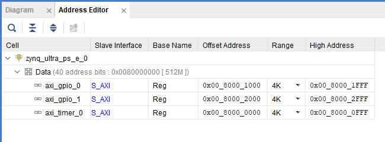

<p align="right">
            Read this page in other languages:<a href="../docs-jp/7-system-design-examples.md">日本語</a>    <table style="width:100%"><table style="width:100%">
  <tr>

<th width="100%" colspan="6"><h1>Zync UltraScale+ MPSoC Embedded Design Tutorial 2020.2 (UG1209)</h1>
</th>

  </tr>
  <tr>
    <td width="17%" align="center"><a href="../README.md">1. Introduction</a></td>
    <td width="16%" align="center"><a href="2-getting-started.md">2. Getting Started</a></td>
    <td width="17%" align="center"><a href="3-system-configuration.md">3. Zynq UltraScale+ MPSoC System Configuration</a></td>
    <td width="17%" align="center"><a href="4-build-sw-for-ps-subsystems.md">4. Build Software for PS Subsystems</a></td>
</tr>
<tr>
    <td width="17%" align="center"><a href="5-debugging-with-vitis-debugger.md">5. Debugging with the Vitis Debugger</a></td>
    <td width="16%" align="center"><a href="6-boot-and-configuration.md">6. Boot and Configuration</a></td>
    <td width="17%" align="center">7. System Design Examples</td>
    <td width="17%" align="center"><a href="8-debugging-problems-with-secure-boot.md">8. Debugging Problems with Secure Boot</a></td>    
  </tr>
</table>

# System Design Examples

This chapter guides you through building a system based on Zynq&reg;
 UltraScale+&trade; devices using available tools and supported software
 blocks. This chapter highlights how you can use the software blocks
 you configured in [Build Software for PS
 Subsystems](4-build-sw-for-ps-subsystems.md) to create a Zynq&reg; UltraScale+ system. It does
 not discuss domain-specific designs, but rather highlights different
 ways to use low-level software available for Zynq UltraScale+ devices.

## Design Example 1: Using GPIOs, Timers, and Interrupts

 The Zynq ZCU102 UltraScale+ Evaluation Board comes with a few user
 configurable Switches and LEDs. This design example makes use of
 bare-metal and Linux applications to toggle these LEDs, with the
 following details:

- The Linux applications configure a set of PL LEDs to toggle using a
     PS Dip Switch, and another set of PL LEDs to toggle using a PL Dip
     Switch (SW17).

- The Linux APU A-53 Core 0 hosts this Linux application, while the
     RPU R5-0 hosts another bare-metal application.

- The R5-Core 0 application uses an AXI Timer IP in Programmable logic
     to toggle PS LED (DS50). The application is configured to toggle
     the LED state every time the timer counter expires, and the Timer
     in the PL is set to reset periodically after a user-configurable
     time interval. The system is configured such that the APU Linux
     Application and RPU Bare-metal Application run simultaneously.

### Configuring Hardware

 The first step in this design is to configure the PS and PL sections.
 This can be done in Vivado IP integrator. You start with adding the
 required IPs from the Vivado IP catalog and then connect the
 components to blocks in the PS subsystem.

1. If the Vivado Design Suite is already open, start from the block diagram shown in and jump to step 4.

2. Open the Vivado Project that you created:

    `C:/edt/edt_zcu102/edt_zcu102.xpr`

3. In the Flow Navigator, under IP integrator, click **Open Block Design** and select `edt_zcu102.bd`.

    

4. Right-click in the block diagram and select **Add IP** from the IP catalog.

#### Adding and Configuring IPs

1. In the catalog, select **AXI Timer**.

    The IP Details information displays, as shown in the following figure.

    

2. Double-click the **AXI Timer** IP to add it to the design.

3. Double-click the **AXI Timer** IP again to configure the IP, as
     shown in following figure.

    

4. Click **OK**.

5. Again, right-click in the block diagram and select **Add IP**.

6. Search for "AXI GPIO" and double-click the **AXI GPIO** IP to add it to the design.

7. Repeat step 5 and step 6 to add another instance of AXI GPIO IP.

8. Double-click **axi_gpio_0** and select **Push button 5bits** from the GPIO Board Interface drop- down list.

    

9. Navigate to the IP Configuration and de-select the **Enable Dual Channel** option.

10. Click **OK** to configure the AXI_GPIO for Push buttons.

11. Double-click **axi_gpio_1**.

12. Configure axi_gpio_1 for PL LEDs by selecting led_8bits from the  GPIO Board Interface drop-down list, as shown in the following figure.

    

13. Navigate to the IP Configuration and de-select the **Enable Dual Channel** option.

14. Click **OK** to configure the AXI_GPIO for LED.

#### Connecting IP Blocks to Create a Complete System

 Make the initial connections using Board presets. To do this, follow these steps:

1. Double-click the Zynq UltraScale+ IP block, and select a PL-PS
     interrupt as shown in the following figure (Ignore and move to the
     next step, if this is selected by default).

    

2. In PS-PL Configuration, expand PS-PL Interfaces and expand the
     Master Interface.

3. Expand AXI HPM0 LPD and set the AXI HPM0 LPD Data Width drop-down to
     128-bit, as shown in the following figure.

    

4. Click **OK** to complete the configuration and return to the block
     diagram.

5. In the diagram view, connect the interrupt port from axi_timer_0 to
     pl_ps_irq\[0:0\].

6. Click **Run Connection Automation**. Do not click **Run Block Automation**.

     

7. In the Run Connection Automation dialog box, click **All Automation**.

8. Click **OK**.

9. In the Address Editor view, verify
     that the corresponding IPs are allocated the same Address Map, as
     shown in the following figure. If not, set the offset address such
     that they match the following figure.

     

10. Validate the design and generate the output files for this design,
     as described in the following sections.

#### Validating the Design and Generating Output

1. Return to the block diagram view and save the Block Design (press
     **Ctrl + S**).

2. Right-click in the white space of the Block Diagram view and select
     **Validate Design**. Alternatively, you can press the **F6** key.

    A message dialog box opens and states "Validation successful. There
    are no errors or critical warnings in this design."

3. Click **OK** to close the message.

4. In the Block Design view, click the **Sources** tab.

5. Click **Hierarchy**.

6. In the Block Diagram, Sources window, under Design Sources, expand edt_zcu102_wrapper.

7. Right-click the top-level block diagram, titled **edt_zcu102_i :  edt_zcu102 (edt_zcu102.bd)** and select **Generate Output Products**.

    The Generate Output Products dialog box opens, as shown in the
    following figure.

    

    >***Note*:** If you are running the Vivado Design Suite on a Linux host
    machine, you might see additional options under Run Settings. In this
    case, continue with the default settings.

8. Click **Generate**.

9. When the Generate Output Products process completes, click **OK**.

10. In the Block Diagram Sources window, click the **IP Sources** tab.
     Here you can see the output products that you just generated, as
     shown in the following figure.

    

#### Synthesizing the Design, Running Implementation, and Generating the Bitstream

1. You can now synthesize the design. In the Flow Navigator pane, under Synthesis, click **Run Synthesis**.

    

2. If Vivado prompts you to save your project before launching synthesis, click **Save**.

    While synthesis is running, a status bar displays in the upper
    right-hand window. This status bar spools for various reasons
    throughout the design process. The status bar signifies that a process
    is working in the background.

    

    When synthesis completes, the Synthesis Completed dialog box opens.

3. Select Run Implementation and click **OK**.

    Again, notice that the status bar describes the process running in the
    background. When implementation completes, the Implementation
    Completed dialog box opens.

4. Select Generate Bitstream and click **OK**.

    When Bitstream Generation completes, the Bitstream Generation Completed dialog box opens.

5. Click **Cancel** to close the window.

6. After the Bitstream generation completes, export the hardware to the Vitis IDE.

#### Exporting Hardware Platform

1. In the Vivado Design Suite, select **File→ Export → Export Hardware**. The Export Hardware Platform window opens.

2. Select Platform Type is **Fixed** and click **Next**.

3. In Output window, select **Include bitstream** click **Next**.

4. In Files window, provide the XSA file
     name and Export path and click **Finish**.

      

    The hardware platform file is generates in the specified path.

### Configuring Software

 This use case has a bare-metal application running on an R5 core and a
 Linux Application running on APU Linux Target. Most of the software
 blocks will remain the same as mentioned in [Build Software for PS Subsystems](4-build-sw-for-ps-subsystems.md). The software for this
 design example requires additional drivers for components added in the
 PL Logic. For this reason, you will need to generate a new Bare-metal
 BSP in the Vitis IDE using the Hardware files generated for this
 design. Linux also requires the Linux BSP to be reconfigured in sync
 with the new hardware platform file (XSA).

 Before you configure the software, first look at the application
 design scheme. The system has a bare-metal application on RPU, which
 starts with toggling the PS LEDs for a user configurable period. The
 LEDs are set to toggle in synchronization with PL AXI Timer running in
 the PL block. The application sets the AXI Timer in the generate mode
 and generates an interrupt every time the Timer count expires. The
 application is designed to toggle the PS LED state after handling the
 Timer interrupt. The application runs in an infinite while loop and
 sets the RPU in WFI mode after toggling the LEDs for the
 user-configured time period. This LED toggling sequence can be
 repeated again by getting the RPU out of WFI mode using an external
 interrupt. For this reason,

 the UART interrupt is also configured and enabled in the same
 application. While this application runs on the RPU, the Linux target
 also hosts another Linux application. The Linux application uses user
 Input from PS or PL switches to toggle PL LEDs. This Linux application
 also runs in an infinite while loop, waiting for user input to toggle
 PL LEDs. The next set of steps show how to configure System software
 and build user applications for this design.

#### Configure and Build Linux Using PetaLinux

1. Create the Linux images using PetaLinux. The Linux images must be
     created in sync with the hardware configuration for this design.
     You will also need to configure PetaLinux to create images for SD
     boot.

2. Repeat steps 2 to 13 as described in [Example Project: Create Linux Images using PetaLinux](4-build-sw-for-ps-subsystems.md#example-project-create-linux-images-using-petalinux) to update the device tree and build Linux images using PetaLinux. Alternatively, you can also use the Linux image files shared with this tutorial. The images for this section can be found in `<design_files/design>`.

3. Follow step 15 to verify the images. The next step is to create a Bare-metal Application targeted for Arm Cortex-R5F based RPU.

 >***Note*:** For this design example, you must import the application
 source files available in the Design Files ZIP file released with this
 tutorial. For information about locating these design files, see the
 [Design Files for This Tutorial](2-getting-started.md#design-files-for-this-tutorial).

#### Creating the Bare-Metal Application Project

1. In the Vitis IDE, select **File → New → Application Project**. The
     New Project wizard opens.

2. Use the information in the table below to make your selections in
     the wizard.

    *Table 12:* **Settings to Create Timer-Based RPU Application Project**

   |  Wizard Screen      |     System Properties          |  Settings      |
   |---------------------|--------------------------------|----------------|
   |  Platform           |  Select platform from repository   |  edt_zcu102_wrapper |
   |  Application project details       |  Application project name       |  tmr_psled_r5       |
   |                      |  System project  name   |   tmr_psled_r5_system                  |
   |                      |  Target processor   |  psu_cortexr5_0     |
   |  Domain             |  Domain             |  psu_cortexr5_0     |
   |  Templates          |  Available templates         |  Empty Application  |

3. Click **Finish**.

    The New Project wizard closes and the Vitis IDE creates the
    tmr_psled_r5 application project, which you can view in the Project
    Explorer.

4. In the Project Explorer tab, expand the tmr_psled_r5 project.

5. Right-click the **src** directory, and select **Import** to open the Import dialog box.

6. Expand General in the Import dialog box and select File System.

7. Click **Next**.

8. Select **Browse** and navigate to the `design-files/design1` folder, which you saved earlier (see [Design Files for This Tutorial](2-getting-started.md#design-files-for-this-tutorial)).

9. Click **OK**.

10. Select and add the timer_psled_r5.c file.

11. Click **Finish**.

 The Vitis IDE automatically builds the application and displays the
 status in the console window.

#### Modifying the Linker Script

1. In the Project Explorer, expand the tmr_psled_r5 project.

2. In the `src` directory, double-click `lscript.ld` to open the linker script for this project.

3. In the linker script in Available Memory Regions, modify following  attributes for psu_r5_ddr_0\_MEM_0:

    Base Address: `0x70000000`
    Size: `0x10000000`

    The following figure shows the linker
    script modification. The following figure is for representation only.
    Actual memory regions might vary in case of isolation settings.

    

    This modification in the linker script ensures that the RPU bare-metal
    application resides above `0x70000000` base address in the DDR, and
    occupies no more than 256 MB of size.

4. Type **Ctrl + S** to save the changes.

5. Right-click the **tmr_psled_r5** project and select **Build Project**.

6. Verify that the application is compiled and linked successfully and that thetmr_psled_r5.elf file was generated in the `tmr_psled_r5\Debug` folder.

7. Verify that the BSP is configured for UART_1. For more information, see [Modifying the Board Support Package](4-build-sw-for-ps-subsystems.md#modifying-the-board-support-package).

#### Creating the Linux Domain for Linux Applications

 To create a Linux domain for generating Linux applications, follow
 these steps:

1. In the Explorer view of the Vitis IDE, expand the edt_zcu102_wrapper platform project.

     

2. Double-click **platform.spr** in the Explorer view to open the platform explorer.

3. Click  in the top-right corner to add the domain.

4. When the new domain window opens, enter the following details:

    - Name: Linux_Domain

    - Display name: Linux_Domain

    - OS: Linux

    - Processor: psu_cortexa53_0

    - Supported runtimes: C/C++

    - Architecture: 64-bit

    - Bif file: Provide a sample bif file

    - Boot Component Directory: Create a boot directory and provide the path

    - Linux Image Directory: Provide the same boot directory path

5. Build the domain to create Linux applications.

#### Creating the Linux Application Project

1. In the Vitis IDE, select **File→ New → Application Project**. The New Project wizard opens.

2. Use the information in the table below to make your selections in the wizard.

    *Table 13:* **Settings to Create New Linux Application Project**

   |  Wizard Screen      |  System Properties          |  Settings       |
   |---------------------|-----------------------------|-----------------|
   |  Platform           |  Select platform from repository   |  edt_zcu102_wrapper |
   |  Application project details       |  Application  project name       |  ps_pl_linux_app    |
   |                      |  System project name    |  ps_pl_linux_app_system                 |
   |                      |  Target processor   |  psu_cortexa53 SMP  |
   |  Domain             |  Domain             |  Linux_Domain        |
   |  Templates          |  Available templates         |  Linux Empty Application        |

3. Click **Finish**.

    The New Project wizard closes and the Vitis IDE creates the
    ps_pl_linux_app application project, which can be found in the Project
    Explorer view.

4. In the Project Explorer view, expand the ps_pl_linux_app project.

5. Right-click the src directory, and select **Import** to open the Import view.

6. Expand General in the Import dialog box and select **File System**.

7. Click **Next**.

8. Select **Browse** and navigate to the design-files/design1 folder, which you saved earlier (see [Design Files for This Tutorial](2-getting-started.md#design-files-for-this-tutorial)).

9. Click **OK**.

10. Select and add the ps_pl_linux_app.c file.

 >***Note*:** The application might fail to build because of a missing
 reference to the pthread library. The next section shows how to add
 the pthread library.

#### Modifying the Build Settings

 This application makes use of Pthreads from the pthread library. Add
 the pthread library as follows:

1. Right-click **ps_pl_linux_app**, and click **C/C++ Build Settings**.

2. Refer to the following figures to add the pthread library.

    

    

3. Click **OK** in both the windows.

4. Right-click the application and select **Build** to build the
     application.

#### Creating a Boot Image

 Now that all the individual images are ready, you will create the boot
 image to load all of these components on a Zynq UltraScale+ device.
 This can be done using the Create Boot Image wizard in the Vitis IDE,
 using the following steps. This example creates a Boot Image BOOT.bin
 in C:\\edt\\design1.

1. Launch the Vitis IDE, if it is not already running.

2. Set the workspace based on the project you created in [Zynq UltraScale+ MPSoC Processing System Configuration](3-system-configuration.md). For example: `C:\edt`.

3. Select **Xilinx → Create Boot Image**.

4. See the following figure for settings in the Create Boot Image wizard.

5. Add the partitions as shown in the following figure.

    >***Note*:** For detailed steps on how to add partitions, see [Boot Sequence for SD-Boot](6-boot-and-configuration.md#boot-sequence-for-sd-boot).

    

    >***Note*:** This Boot image requires PL bitstream
    `edt_zcu102_wrapper.bit` (Partition Type - Datafile, Destination Device - PL). The bitstream partition needs to be added right after the
    bootloader while you create the boot image. Also note that the R5
    application `tmr_psled_r5.elf` is added as partition in this boot image.

6. After adding all the partitions, click **Create Image**.

    >**IMPORTANT!** *Ensure that you have set the correct exception levels
    for ATF (EL-3, TrustZone) and U- Boot (EL-2) partitions. These
    settings can be ignored for other partitions.*

#### Running the Image on a ZCU102 Board

#### Prepare the SD Card

 Copy the images and executables on an SD card and load it in the SD
 card slot in the Board.

1. Copy files BOOT.bin and image.ub to an SD card.

    >***Note*:** BOOT.bin is located in `C:\edt\design1`.

2. Copy the Linux application, `ps_pl_linux_app.elf`, to the same SD card. The application can be found in `C:\edt\ps_pl_linux_app\Debug`.

#### Target Setup

1. Load the SD card into the ZCU102 board, in the J100 connector.

2. Connect the USB-UART on the Board to the Host machine.

3. Connect the Micro USB cable into the ZCU102 Board Micro USB port J83, and the other end into an open USB port on the host machine.

4. Configure the Board to Boot in SD-Boot mode by setting switch SW6 as shown in the following figure.

    

5. Connect 12V Power to the ZCU102 6-Pin Molex connector.

6. Start a terminal session, using Tera Term or Minicom depending on the host machine being used, as well as the COM port and baud rate for your system, as shown in .

7. For port settings, verify the COM port in the device manager.

    There are four USB-UART interfaces exposed by the ZCU102 Board.

8. Select the COM Port associated with the interface with the lowest
     number. In this case, for UART-0, select the COM port with
     interface-0.

9. Similarly, for UART-1, select COM port with interface-1.

    Remember that the R5 BSP has been configured to use UART-1, and so R5
    application messages will appear on the COM port with the UART-1
    terminal.

#### Power ON Target and Run Applications

1. Turn on the ZCU102 Board using SW1, and wait until Linux loads on the board.

    You can see the initial Boot sequence messages on your Terminal Screen
    representing UART-0. Also, the terminal screen configured for UART-1
    also prints a message. This is the print message from the R-5
    bare-metal Application running on RPU, configured to use UART-1
    interface. This application is loaded by the FSBL onto RPU.

2. Now that this application is running, notice the PS LED being toggled by the application, and follow the instructions in the application terminal.

    

##### Running Linux Applications

 After Linux is up on the ZCU102 system, log in to the Linux target
 with login: root and password: root. The Linux target is now ready for
 running applications.

 Run the Linux application using following steps:

1. Copy the application from SD card mount point to /tmp

    `# cp /run/media/mmcblk0p1/ps_pl_linux_app.elf /tmp`

    >***Note*:** Mount the SD card manually if you fail to find SD card
    contents in this location:`# mount /dev/mmcblk0p1 /media/`. Copy the
    application to `/tmp`. `# cp /media/ ps_pl_linux_app.elf /tmp`.

2. Run the application.

    `# /tmp/ps_pl_linux_app.elf`

    

## Design Example 2: Example Setup for Graphics and DisplayPort Based Sub-System

 This design example is primarily based on the Graphics Processing Unit
 and the DisplayPort on a Zynq UltraScale+ MPSoC device. The main idea
 behind this example is to demonstrate the configurations, packages,
 and tool flow required for running designs based on GPU and DP on a
 Zynq UltraScale+ MPSoC device. This design example can be broken down
 into the following sections:

1. Configuring the hardware.

2. Configuring PetaLinux RootFS to include the required packages:

    1. GPU-related packages

    2. X Window System and dependencies

3. Building Boot images and Linux images using PetaLinux.

4. Building a Graphics OpenGL ES application targeted for Mali GPU. This application is based on the X Window System.

5. Loading Linux on the ZCU102 board and running the Graphics Application on the target to see the result on the DisplayPort.

### Configuring the Hardware

 In this section, you will configure the processing system to set dual
 lower GT lanes for the DisplayPort. The hardware configuration in this
 section is based on the same Vivado project that you created in
 [Design Example 1: Using GPIOs, Timers, and Interrupts](#design-example-1-using-gpios-timers-and-interrupts).

#### Configuring Hardware in Vivado IP Integrator

1. Ensure that the edt_zcu102 project and the block design are open in Vivado.

2. Double-click the Zynq UltraScale+ Processing System block in the Block Diagram window and wait till the Re-customize IP page opens.

3. In Re-customize IP window, click **I/O Configuration → High Speed**.

4. Deselect PCIe peripheral connection.

5. Expand DisplayPort and set Lane
     Selection to Dual Lower, as shown in following figure:

     

    >***Note*:** The DisplayPort lane selection is set to Dual lane to
    support UHD\@30 resolution in the design example of this tutorial.
    This configuration will lock display for UHD\@30 as well as lower
    resolution like 1080p 60 and others, for corresponding monitors.

6. Click **OK** to close the Re-customize IP wizard.

    >**CAUTION!** *Do not click the **Run Block Automation** link. Clicking
    the link will reset the design as per board preset and disable the
    design updates you made using in this section.*

7. Click **File→ Save Block Design** to save the block design. Alternatively, you can press **CTRL + S** to save the block design.

8. Click **Generate Bitstream**, to re-synthesize the design and generate the Bitstream.

9. After the bitstream is generated successfully, export the hardware
     platform using the Vivado export hardware platform wizard as shown
     in [Exporting Hardware Platform](#exporting-hardware-platform).

10. Copy the XSA file to a Linux host machine.

 The next section describes steps to build Linux for your hardware
 configuration and also add additional software packages for GPU and
 the X Window System.

### Modifying the Configuration and Building Linux Images Using PetaLinux

 Re-configure the PetaLinux BSP in sync with the new hardware changes.
 This section uses the PetaLinux project you created in Example
 Project: Create Linux Images using PetaLinux.

1. Change to the PetaLinux directory using the following command:

    `$ cd xilinx-zcu102-2020.1`

2. Copy the hardware platform edt_zcu102_wrapper.xsa in the Linux Host machine.

3. Reconfigure the BSP using the following command:

    `$ petalinux-config --get-hw-description=<path containingedt_zcu102_wrapper.xsa>/`

    The PetaLinux configuration wizard opens.

4. Save and exit the wizard without any additional configuration
     settings. Wait until PetaLinux reconfigures the project.

5. Clean the existing bootloader image. This is to ensure that the
     bootloader is recreated in sync with new hardware design.

    `$ petalinux-build -c bootloader -x distclean`

### Building the Mali OpenGLES Application

 This section leads you through building a Triangle-based Cube
 application. This application is written in OpenGLES and is based on
 the X Window System. For more details and for the application source
 code, refer to tricube in the design_files folder of the zip file that
 accompanies this tutorial. See [Design Files for This Tutorial](2-getting-started.md#design-files-for-this-tutorial).

 Use the following steps to build the OpenGLES application:

1. Copy the entire application source directory of tricube to the Linux
     host machine in the recipe-apps directory of the PetaLinux
     project.

    `<PetaLinux-Project>/project-spec/meta-user/recipes-apps/tricube`

2. Add the newly created tricube in user-rootfsconfig, which is located
     in `<plnx_project>/project-spec/meta-user/conf/user-rootfsconfig`.

    With this addition, the file will look like below. Notice the new
    application in bold.

    ```
    CONFIG_gpio-demo
    CONFIG_peekpoke
    CONFIG_tricube
    ```

3. Refer to recipe `tricube/tricube.bb` for detailed instructions and
     libraries used for building this application. The X Window System
     (X11) packages included while building the above application is
     application dependent. Libraries included in `tricube.bb` recipe are
     based on the packages that were used in the application.

### Enable GPU Libraries and Other Packages in RootFS

 In this section, you will use the PetaLinux rootfs Configuration
 wizard to add the Mali GPU libraries. PetaLinux is shipped with Mali
 GPU libraries and device drivers for Mali GPU. By default, the Mali
 driver is enabled in the kernel tree, but Mali user libraries need to
 be configured (on an as-needed basis) in the root file system. In
 addition to this, you will use the same wizard to include the X Window
 System libraries.

1. Open the PetaLinux rootfs Configuration wizard:

    `$ petalinux-config -c rootfs`

2. Navigate to and enable the following packages:

    ```
    Filesystem Packages ---> libs ---> libmali-xlnx ---> libmali-xlnx
    Filesystem Packages ---> libs ---> libmali-xlnx ---> libmali-xlnx-dev
    ```

    These packages enable you to build and Run OpenGLES applications
    targeted for Mali GPU in the Zynq UltraScale+ MPSoC device.

3. Add X11 package groups to add X Window related packages:

    ```
    Petalinux Package Groups > packagegroup-petalinux-x11 >packagegrouppetalinux-
    x11
    Petalinux Package Groups > packagegroup-petalinux-x11 >
    packagegroup-petalinux-x11-dev
    ```

4. Add the OpenGLES application created in the earlier section:

    `User Packages \-\--\ \[\*\]tricube`

5. After enabling all the packages, save the config file and exit the rootfs configuration settings.

6. Build the Linux images using the following command:

    `$ petalinux-build`

    >***Note*:** If the PetaLinux build fails, use the following commands
    to build again:

7. Verify that the `image.ub` Linux image file is generated in the `images/linux` directory.

8. Generate the Boot image for this design example as follows:

    ```
    $ petalinux-package --boot --fsbl images/linux/zynqmp_fsbl.elf --pmufw images/linux/pmufw.elf --atf images/linux/bl31.elf --fpga images/linux/system.bit
    --u-boot images/linux/u-boot.elf
    ```

 A `BOOT.BIN` Boot image is created. It is composed of the FSBL boot
 loader, the PL bitstream, PMU firmware and ATF, and U-Boot.
 Alternatively, see the steps in [Creating a Boot Image](#creating-a-boot-image) to create this boot image.

 >**IMPORTANT!** *This example uses the GPU packages based on X Window
 system, which is the default setting in PetaLinux 2019.2. To enable
 Frame Buffer fbdev based GPU Packages in PetaLinux 2019.2, add the
 following line in `/project-spec/meta-user/conf/petalinuxbsp.conf`:
 >
 >*DISTRO_FEATURES_remove_zynqmp = " x11"*
 >
 >*See the example eglfbdev application (based on fdev) that is
 available in the [Design Files for
 This Tutorial](2-getting-started.md#design-files-for-this-tutorial). For more information, see
 the Xilinx Answer
 [68821](https://www.xilinx.com/cgi-bin/docs/ndoc?t=answers%3Bd%3D68821.html).*

### Loading Linux and Running the OpenGLES Application on the Target and Viewing the Result on the Display Port

#### Preparing the SD Card

 Now that the Linux images are built and the application is also built,
 copy the following images in an SD card and load the SD card in ZCU102
 board.

- `BOOT.BIN`

- `image.ub`

#### Running the Application on a Linux Target

##### Setting Up the Target

 Do the following to set up the target:

1. Load the SD card into the J100 connector of the ZCU102 board.

2. Connect the Micro USB cable into the ZCU102 Board Micro USB port J83, and the other end into an open USB port on the host Machine.

    Also, make sure that the JTAG cable is disconnected. If the cable is
    not disconnected, the system might hang.

3. Connect a DisplayPort monitor to the ZCU102 Board. The DisplayPort
     cable from the DP monitor can be connected to the DisplayPort
     connector on the ZCU102 board.

    >***Note*:** These images were tested on a UHD\@30 Hz and a FullHD\@60
    Hz Display Port capable monitor.

4. Configure the Board to Boot in SD-Boot mode by setting switch SW6 as shown in the following figure.

     

5. Connect 12V Power to the ZCU102 6-Pin Molex connector.

6. Start a terminal session, using Tera Term or Minicom depending on
     the host machine being used, as well as the COM port and baud rate
     for your system, as shown in .

7. For port settings, verify the COM port in the device manager.

    There are four USB-UART interfaces exposed by the ZCU102 Board. Select
    the COM port associated with the interface with the lowest number. In
    this case, for UART-0, select the COM port with interface-0.

#### Powering On the Target and Running the Applications

 Do the following to set up the target:

1. Turn on the ZCU102 Board using SW1, and wait until Linux loads on
     the board.

2. After Linux loads, log in to the target Linux console using root for the login and password.

3. Set the display parameters and start Xorg with the correct depth.

    ```
    # export DISPLAY=:0.0
    # /usr/bin/Xorg -depth 16&
    ```

4. Run the tricube application.

   `# tricube`

    At this point, you can see a rotating multi-colored cube and a
    rotating triangle on the display port. Notice that the cube is also
    made of multi-colored triangles.

    


© Copyright 2017-2020 Xilinx, Inc.
